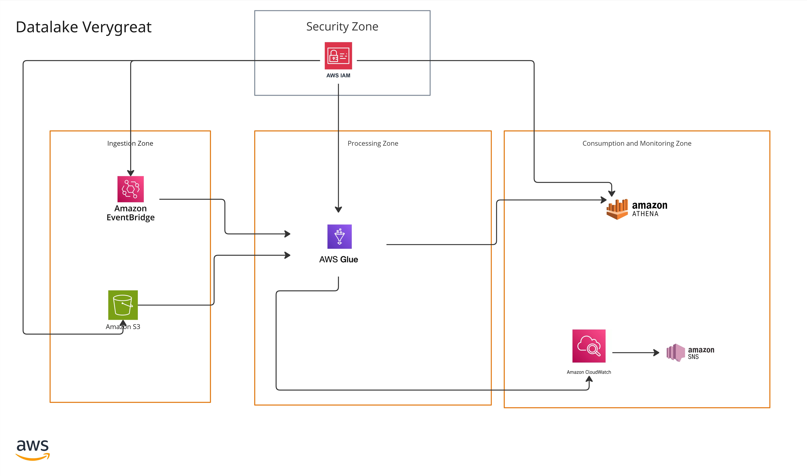

# System Architecture

## Beauty Products Data Lake

**Version:** 1.0.0
**Last Updated:** January 26, 2026

---

## Overview

The Beauty Products Data Lake follows a **Medallion Architecture** pattern (Raw → Curated → Metadata) implemented on AWS. The system ingests CSV files, applies comprehensive data quality checks, transforms data into a curated format, and makes it available for analytics via Amazon Athena.

## Visual Architecture Diagram

*For a detailed visual representation of the system architecture, refer to the diagram above.*

---

## Component Descriptions

### 1. Storage Layer (S3)

#### Raw Zone (`very-great-products-raw-us-east-1-{environment}`)

- **Purpose**: Immutable storage of source CSV files
- **Format**: CSV (as received from source)
- **Retention**: 90 days Standard, then Glacier; delete after 1 year
- **Features**: Versioning enabled, AES-256 encryption (SSE-S3)
- **Structure**: `landing/beauty-products/YYYY/MM/DD/beauty-products_YYYYMMDD.csv`

#### Curated Zone (`very-great-products-processed-us-east-1-{environment}`)

- **Purpose**: Cleaned, validated, and transformed data
- **Format**: Parquet with Snappy compression
- **Partitioning**: By `year` and `month_num` for query optimization
- **Structure**:
  - `curated/beauty-products/year=YYYY/month_num=MM/` - High-quality data
  - `quarantine/beauty-products/YYYY/MM/DD/` - Low-quality records
  - `error/beauty-products/YYYY/MM/DD/` - Malformed/duplicate records
  - `quality-reports/beauty-products/YYYY/MM/DD/` - Quality metrics JSON

#### Metadata Zone (`very-great-products-metadata-us-east-1-{environment}`)

- **Purpose**: Lineage tracking, Athena query results
- **Structure**:
  - `lineage/` - Data lineage metadata
  - `athena-results/` - Query execution results

### 2. Processing Layer

#### AWS Glue ETL Job (`beauty-products-etl-job`)

- **Runtime**: AWS Glue 4.0 (Python 3.10, Spark 3.5.4)
- **Worker Type**: G.1X (2 workers)
- **Schedule**: Daily at 2 AM UTC via EventBridge
- **Capabilities**:
  - CSV parsing with error handling
  - 20+ data quality validation rules
  - Per-record quality scoring (0.0000 - 1.0000)
  - Deduplication based on natural key
  - Quality-based routing (pass/warn/fail)
  - Anomaly detection (revenue > $10M, items > 1M)
  - Quality report generation
  - Lineage metadata tracking

#### AWS Glue Crawlers

- **Raw Crawler** (`beauty-products-raw-crawler`): On-demand, updates `beauty_products_db.raw_beauty_products`
- **Quality Crawler** (`beauty-products-quality-crawler`): Scheduled daily at 3 AM UTC, updates `beauty_products_metadata_db.data_quality_metrics`

### 3. Data Catalog

#### AWS Glue Catalog

- **Databases**:
  - `beauty_products_db`: Business data tables and views
  - `beauty_products_metadata_db`: Quality metrics and metadata
- **Tables**:
  - `raw_beauty_products`: Raw CSV data (schema-on-read)
  - `curated_beauty_products`: Curated Parquet data (21 columns)
  - `data_quality_metrics`: Quality report metrics
  - Additional tables for error tracking and lineage

### 4. Analytics Layer

#### Amazon Athena

- **Workgroup**: `beauty-products-athena-{environment}`
- **Query Engine**: Presto-based SQL engine
- **Performance**: < 5 seconds for standard aggregations (LIMIT 10)
- **Views**:
  - `vw_high_quality_products`: Filter for production analytics (quality >= 0.95)
  - `vw_sales_by_category_month`: Aggregated sales metrics by category
  - `vw_quality_trends`: Track quality over time
  - `vw_product_performance`: Product lifetime metrics
  - `vw_shop_leaderboard`: Rank shops by performance

### 5. Monitoring Layer

#### CloudWatch Dashboard (`beauty-products-pipeline-metrics`)

- **Widgets**:
  - Glue Job Task Status (completed/failed tasks)
  - Job Completions count
  - Data Changes count
  - Average Quality Score (0-1 scale)
  - Pass Rate (percentage)
  - Error Rate (percentage)
  - Records by Quality Tier (passed/warned/failed/duplicates)
  - Alerts and Errors count

#### CloudWatch Alarms

- `beauty-products-job-failure`: Job state = FAILED
- `beauty-products-low-quality`: Avg quality score < 0.80
- `beauty-products-high-error-rate`: Error rate > 5%

#### SNS Notifications

- Email alerts for all CloudWatch alarms
- Configurable via Terraform variable `alert_email`

---

## Data Flow

### 1. Ingestion

1. CSV files uploaded to Raw Zone S3 bucket
2. Files organized by date: `landing/beauty-products/YYYY/MM/DD/`
3. EventBridge rule triggers Glue job at 2 AM UTC daily

### 2. Processing

1. Glue job reads CSV files from Raw Zone
2. Applies transformations and quality scoring
3. Routes records based on quality:
   - **PASS** (score >= 0.95): → Curated zone
   - **WARN** (score 0.70-0.95): → Curated zone (flagged)
   - **FAIL** (score < 0.70): → Quarantine zone
   - **DUPLICATES**: → Error zone
   - **MALFORMED**: → Error zone
4. Generates quality report JSON
5. Writes lineage metadata

### 3. Catalog Updates

1. Crawlers run to discover new data
2. Update Glue Catalog tables with schema information
3. Enable SQL queries via Athena

### 4. Analytics

1. Users query data via Athena
2. Queries leverage partitioned data for performance
3. Views provide pre-aggregated metrics
4. Results stored in metadata bucket

### 5. Monitoring

1. Glue job publishes metrics to CloudWatch
2. Dashboard displays real-time metrics
3. Alarms trigger SNS notifications on thresholds

---

## Quality Framework

### Quality Scoring System

- **Base Score**: 1.0000 (perfect record)
- **Penalties**: Applied for data quality issues
  - INVALID_DATE: -0.20
  - SYNTHETIC_PRODUCT_ID: -0.15
  - MISSING_PRODUCT_NAME: -0.20
  - INVALID_REVENUE: -0.15
  - INVALID_AVG_PRICE: -0.10
  - MISSING_ITEMS: -0.10
  - SUSPICIOUS_GROWTH: -0.05

### Quality Tiers

- **PASS** (>= 0.95): High-quality data for production analytics
- **WARN** (0.70 - 0.95): Acceptable quality with warnings
- **FAIL** (< 0.70): Low quality, routed to quarantine

### Quality Reports

- Generated after each job run
- JSON format with metrics:
  - Total records, passed/warned/failed counts
  - Pass rate, average quality score
  - Quality issues breakdown
  - Job run metadata

---

## Security

### Data Protection

- **Encryption at Rest**: AES-256 (S3 SSE-S3)
- **Encryption in Transit**: TLS 1.2+
- **Public Access**: Blocked on all buckets
- **IAM**: Least privilege principle
- **Audit Trail**: CloudTrail enabled

### Access Control

- IAM roles for Glue jobs
- S3 bucket policies for access control
- Athena workgroup for query access
- Lake Formation integration (optional)

---

## Performance Characteristics

### ETL Job Performance

- **Average Duration**: 5-8 minutes (10K records)
- **Throughput**: ~2,000 records/minute
- **Worker Configuration**: G.1X, 2 workers
- **Compression**: ~80% reduction (Parquet/Snappy vs CSV)

### Query Performance

- **Standard Aggregations**: < 5 seconds (LIMIT 10)
- **Partitioned Queries**: < 3 seconds (with year/month filters)
- **Full Table Scans**: Performance varies by data volume

---

## Scalability

### Horizontal Scaling

- Glue workers can be increased for larger datasets
- Athena automatically scales query execution
- S3 provides unlimited storage capacity

### Vertical Scaling

- Worker types: G.1X (default), G.2X (for complex transformations)
- Can be adjusted based on workload requirements

---

## Related Documentation

- [Deployment Guide](CLIENT-DEPLOYMENT-GUIDE.md) - Step-by-step deployment instructions
- [Operations Guide](CLIENT-OPERATIONS-GUIDE.md) - Daily operations and support
- [S3 Bucket Structure](s3-bucket-structure.md) - Detailed storage organization
- [Data Quality Framework](../README.md#data-quality) - Quality rules and thresholds
- [Athena Views](../athena-views.sql) - SQL view definitions

---

**Note**: For questions or support, refer to the [Operations Guide](CLIENT-OPERATIONS-GUIDE.md) or contact your system administrator.

