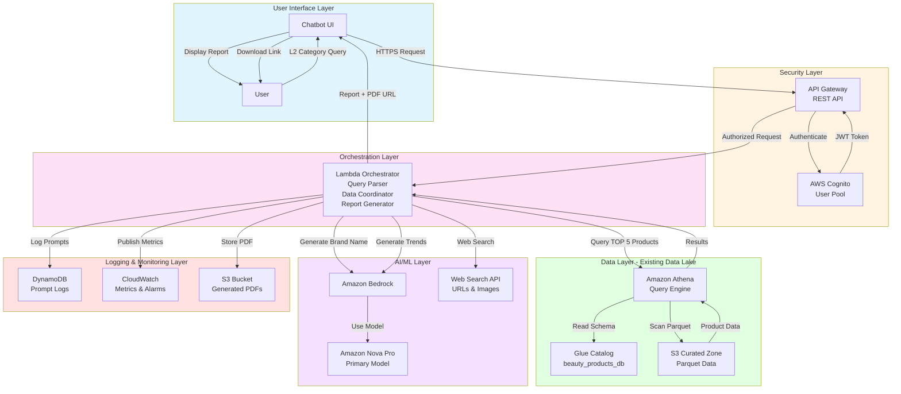
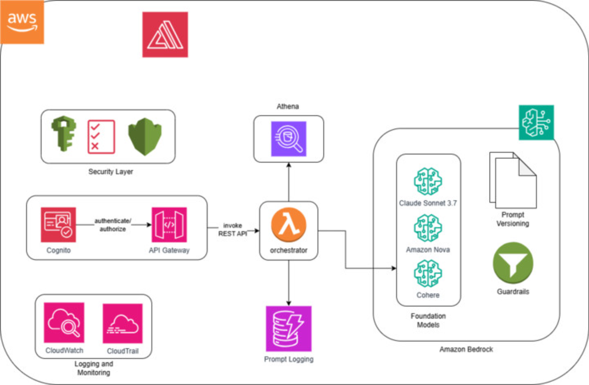
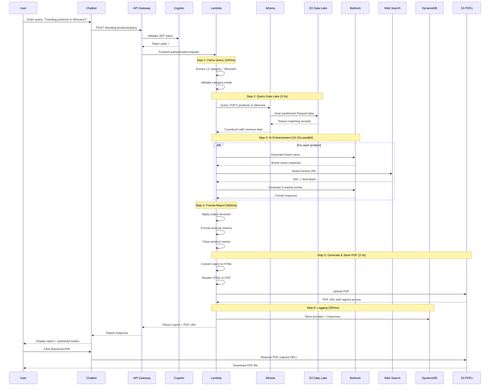
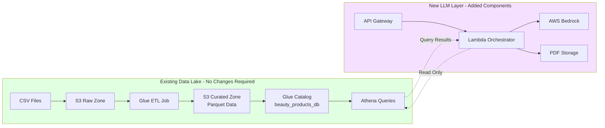
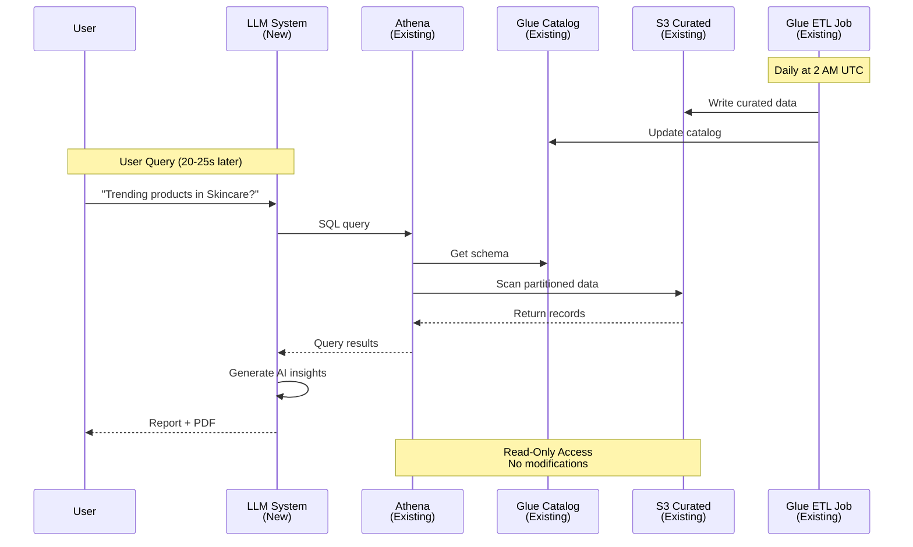
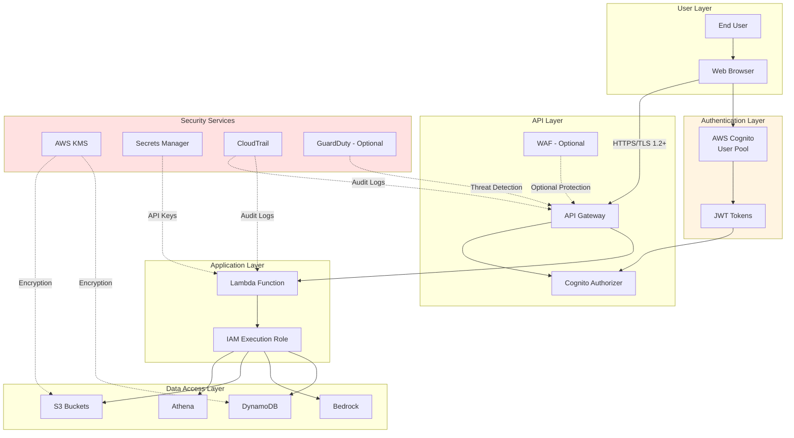
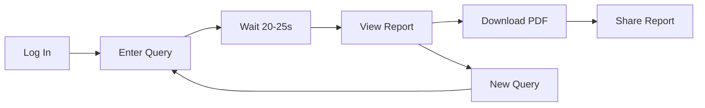
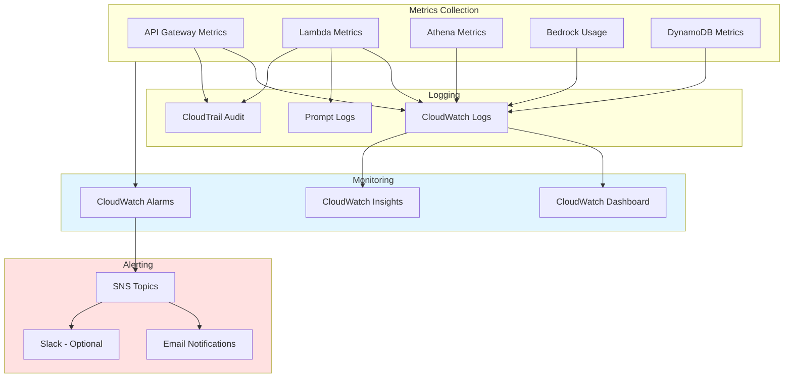

# LLM Trending Products Report Generator

## System Architecture

**Version:** 1.1.0
**Last Updated:** January 30, 2026
**Target Audience:** Client Stakeholders
**Status:** Implemented

---

## Related Documentation

- [Data Lake Architecture](ARCHITECTURE.md) - Existing Beauty Products Data Lake infrastructure
- [Operations Guide](CLIENT-OPERATIONS-GUIDE.md) - Daily operations and support procedures
- [Deployment Guide](CLIENT-DEPLOYMENT-GUIDE.md) - Deployment instructions
- [Architecture Diagram](diagrams/arquitectura_llm.png) - Visual system architecture

---

## Table of Contents

1. [Executive Summary](#executive-summary)
2. [System Architecture Overview](#system-architecture-overview)
3. [Component Descriptions](#component-descriptions)
4. [Data Flow](#data-flow)
5. [Report Output Format](#report-output-format)
6. [Integration with Existing Datalake](#integration-with-existing-datalake)
7. [Security &amp; Authentication](#security--authentication)
8. [Performance Characteristics](#performance-characteristics)
9. [User Guide](#user-guide)
10. [Monitoring &amp; Support](#monitoring--support)
11. [Future Enhancements](#future-enhancements)

---

## Executive Summary

The **LLM Trending Products Report Generator** is an AI-powered analytics system that generates comprehensive trending product reports for the beauty products industry. Built on AWS Bedrock, this system integrates seamlessly with the existing Beauty Products Data Lake to deliver intelligent, data-driven insights about trending products across different beauty categories.

### What It Does

The system enables users to ask natural language questions about trending products in specific beauty categories (such as "What are the trending products in Skincare?") and receive AI-generated reports that include:

- **Top 5 Trending Products** by revenue and growth within the requested category
- **Brand Intelligence** - AI-identified brand names and product information
- **Revenue Analytics** - 30-day revenue trends, growth percentages, and category rankings
- **Market Trends** - 5 macro trends explaining why each product is succeeding
- **Visual Reports** - Product images, descriptions, and brand website links
- **PDF Export** - Downloadable reports for sharing and presentations

### Key Capabilities

| Capability                         | Description                                                                |
| ---------------------------------- | -------------------------------------------------------------------------- |
| **Natural Language Queries** | Users ask questions in plain English                                       |
| **L2 Category Focus**        | Analyzes specific product subcategories (Skincare, Haircare, Makeup, etc.) |
| **AI-Powered Insights**      | Leverages AWS Bedrock (Amazon Nova Pro, us-east-1 only)                    |
| **Data-Driven**              | Uses real sales data from the existing Beauty Products Data Lake           |
| **Fast Response**            | Delivers complete reports in 20-25 seconds                                 |
| **Secure Access**            | Protected by AWS Cognito authentication and authorization                  |
| **PDF Generation**           | Creates downloadable, professional reports                                 |

### Integration with Existing Infrastructure

This system is designed as an **enhancement layer** on top of the existing Beauty Products Data Lake. It leverages:

- **Existing curated data** from the S3-based data lake
- **Athena queries** against the `beauty_products_db.curated_beauty_products` table
- **Quality filters** ensuring only high-quality data (score >= 0.95) is used
- **Partitioned storage** for fast query performance
- **CloudWatch monitoring** integrated with existing dashboards

No changes are required to the existing data lake infrastructure. The LLM system reads from curated data and adds AI-powered analysis capabilities.

### Business Value

- **Faster Insights**: Generate comprehensive trend reports in under 30 seconds vs. hours of manual research
- **AI-Enhanced Analysis**: Combine sales data with market intelligence and trend analysis
- **Scalable Intelligence**: Query any L2 category on-demand without pre-built reports
- **Competitive Intelligence**: Understand not just what's trending, but why
- **Professional Output**: Client-ready PDF reports with visuals and data

### Target Users

- Business analysts exploring product trends
- Product managers researching market opportunities
- Marketing teams identifying successful products
- Executive stakeholders reviewing category performance
- Sales teams understanding competitive landscape

### Architecture Highlights

```
User Query → API Gateway → Lambda Orchestrator → Athena + Bedrock → AI-Generated Report + PDF
              ↓                                      ↓           ↓
           Cognito Auth                         Data Lake   Foundation Models
```


The system combines the reliability of structured data lake analytics with the intelligence of large language models to deliver unprecedented insights into beauty product trends.

---

## System Architecture Overview

The LLM Trending Products Report Generator follows a serverless, event-driven architecture on AWS. The system is organized into five distinct layers that work together to transform user queries into comprehensive AI-powered reports.

### Architecture Diagram




### Visual Reference

For a detailed visual representation of the system architecture, refer to the architecture diagram:



*The diagram shows the complete AWS infrastructure including Cognito authentication, API Gateway, Lambda orchestrator, Bedrock foundation models, and integration with the existing Athena data lake.*

### Layer Descriptions

#### 1. User Interface Layer

- **Chatbot UI**: Web-based conversational interface where users enter L2 category queries
- **User Experience**: Simple text input, visual report display, PDF download button

#### 2. Security Layer

- **AWS Cognito**: Manages user authentication, login/password protection
- **API Gateway**: REST API endpoint with request validation and authorization
- **IAM Roles**: Least privilege access control for all AWS services

#### 3. Orchestration Layer

- **Lambda Function**: Central orchestrator that coordinates all operations
  - Parses natural language queries to extract L2 categories
  - Queries Athena for product data
  - Calls Bedrock for AI generation
  - Formats reports according to specifications
  - Generates PDFs for download
  - Handles errors gracefully

#### 4. Data Layer (Existing Infrastructure)

- **Amazon Athena**: SQL query engine for data lake
- **AWS Glue Catalog**: Metadata repository with table schemas
- **S3 Curated Zone**: High-quality Parquet data partitioned by year/month
- **Quality Filters**: Only uses data with quality score >= 0.95

#### 5. AI/ML Layer

- **Amazon Bedrock**: Managed service for foundation models
  - **Amazon Nova Pro**: Primary model for brand names, trend generation, and product search (us-east-1 only; no cross-region inference)
- **Web Search API**: Retrieves brand URLs, product descriptions, and images

#### 6. Logging & Monitoring Layer

- **DynamoDB**: Stores prompt/response pairs for audit and improvement
- **CloudWatch**: Metrics, logs, and alarms for system health monitoring
- **S3 PDF Storage**: Stores generated PDF reports with signed URLs

### Key Architecture Principles

1. **Serverless**: No servers to manage, automatic scaling, pay-per-use
2. **Loosely Coupled**: Each layer operates independently with clear interfaces
3. **Existing Integration**: Reads from existing data lake without modifications
4. **Security First**: Authentication, authorization, and encryption at every layer
5. **Observable**: Comprehensive logging and monitoring throughout
6. **Resilient**: Fallback models, error handling, graceful degradation

---

## Component Descriptions

This section provides detailed descriptions of each component in the LLM Trending Products Report Generator system.

---

### Security Layer

#### AWS Cognito User Pool

**Purpose**: Manages user authentication and authorization for the chatbot interface.

**Key Features**:

- User registration and login/password protection
- Multi-factor authentication (MFA) support
- JWT token generation for API authentication
- User session management
- Password policies and security controls

**Configuration**:

- User pool name: `beauty-products-trending-chatbot-users`
- Token expiration: Configurable (typically 1 hour)
- Password requirements: Minimum 8 characters, complexity rules
- Integration: API Gateway uses Cognito as authorizer

**Getting the Cognito Client ID**: Run `terraform output -raw cognito_client_id` from the `terraform/` directory after deployment. The script `scripts/call-api-llm.ps1` obtains this value automatically when invoking the API.

**Benefits**:

- Industry-standard OAuth 2.0 / OpenID Connect
- Secure credential storage (never exposed to application)
- Built-in protection against common attacks
- Scalable to thousands of users

#### API Gateway (REST API)

**Purpose**: Provides a secure, managed REST API endpoint for the chatbot interface.

**Key Features**:

- Request validation and throttling
- CORS configuration for web clients
- Integration with Cognito for authentication
- Request/response transformation
- API versioning support

**Endpoints**:

```
POST /trending-products/query
  - URL: https://{api-id}.execute-api.{region}.amazonaws.com/{stage}/trending-products/query
  - Body: { "query": "What are the top trending products in Skincare?" }   (required; natural language)
  - Headers: Authorization: Bearer <JWT-token>, Content-Type: application/json
  - Response (200): {
      "status": "success",
      "request_id": "<uuid>",
      "query": "<user query>",
      "category": "<extracted L2 category>",
      "report": { ... },
      "pdf_url": "<signed URL or null>",
      "execution_time_ms": <int>,
      "product_count": <int>
    }
```

**Security**:

- Cognito authorizer validates JWT tokens
- Request size limits (max 10MB)
- Rate limiting (e.g., 10 requests/second per user)
- API keys for additional access control (optional)

---

### Orchestration Layer

#### Lambda Orchestrator Function

**Purpose**: Central coordinator that executes the entire workflow from query to report generation.

**Function Details**:

- **Runtime**: Python 3.10
- **Memory**: 1024 MB (adjustable based on workload)
- **Timeout**: 60 seconds (to accommodate AI processing)
- **Concurrency**: Provisioned concurrency for consistent performance

**Core Responsibilities**:

1. **Query Parsing**

   - Extract L2 category from natural language query
   - Validate category against known categories
   - Handle English natural language queries
   - Example: "What are trending products in Skincare?" → Extract "Skincare"
2. **Data Retrieval**

   - Build Athena SQL query for TOP 5 products
   - Execute query using boto3 Athena client
   - Wait for query completion (typically 3-5 seconds)
   - Parse results into structured format
3. **AI Coordination**

   - Call Bedrock API for each product (can be parallelized)
   - Generate brand name from product_name + shop_name
   - Invoke web search for URLs and descriptions
   - Generate 5 supporting trends per product
   - Handle model fallbacks if primary model fails
4. **Report Formatting**

   - Apply exact output structure from specifications
   - Format revenue numbers as currency
   - Format percentages with proper precision
   - Clean product names and descriptions
   - Build complete report JSON
5. **PDF Generation**

   - Convert formatted report to HTML
   - Render HTML to PDF using library (e.g., ReportLab, WeasyPrint)
   - Include product images from URLs
   - Upload PDF to S3 with unique filename
   - Generate signed URL for download (valid for 1 hour)
6. **Logging & Metrics**

   - Log all prompts sent to Bedrock
   - Store responses for audit trail
   - Publish CloudWatch metrics
   - Track execution time for each phase

**Error Handling**:

- Invalid L2 category → Return friendly error with suggestions
- No products found → Return "No trending products" message
- Bedrock timeout → Retry with same model (Nova Pro)
- Athena failure → Return cached data or error message
- Web search failure → Use LLM-generated descriptions only

**Environment Variables**:

```
ATHENA_WORKGROUP=beauty-products-athena-poc
ATHENA_DATABASE=beauty_products_db
BEDROCK_PRIMARY_MODEL=amazon.nova-pro-v1:0
BEDROCK_FALLBACK_MODEL=amazon.nova-pro-v1:0
DQ_THRESHOLD=0.95
PROMPT_LOG_TABLE=beauty-products-prompt-logs
PDF_BUCKET=beauty-products-pdfs
```

---

### Data Layer Integration

#### Amazon Athena

**Purpose**: SQL query engine that reads data from the existing S3 data lake.

**Configuration**:

- **Workgroup**: `beauty-products-athena-{environment}`
- **Database**: `beauty_products_db`
- **Primary Table**: `curated_beauty_products`
- **Result Location**: `s3://very-great-products-metadata-us-east-1-{environment}/athena-results/`

**Query Pattern**:

```sql
WITH ranked_products AS (
  SELECT 
    product_id,
    product_name,
    shop_name,
    l2_category,
    revenue_usd,
    mom_growth_pct,
    item_sold,
    ROW_NUMBER() OVER (
      PARTITION BY l2_category 
      ORDER BY revenue_usd DESC, mom_growth_pct DESC
    ) as revenue_rank
  FROM beauty_products_db.curated_beauty_products
  WHERE l2_category = 'Skincare'
    AND data_quality_score >= 0.95
    AND year = YEAR(CURRENT_DATE)
    AND month_num >= MONTH(CURRENT_DATE) - 1  -- Last 30 days
)
SELECT * FROM ranked_products
WHERE revenue_rank <= 5
ORDER BY revenue_rank;
```

**Performance**:

- Typical query time: 3-5 seconds
- Uses partitioned data (year/month) for optimization
- Results cached for 5 minutes to reduce costs

#### AWS Glue Catalog

**Purpose**: Metadata repository that stores table schemas and partition information.

**Tables Used**:

- `curated_beauty_products`: Main product sales data (21 columns)
- Partitioned by: `year` and `month_num`
- Format: Parquet with Snappy compression

**Views Used**:

- `vw_high_quality_products`: Pre-filters for quality score >= 0.95
- `vw_sales_by_category_month`: Aggregated sales by L2 category

#### S3 Curated Zone

**Purpose**: Storage layer for high-quality, curated product data.

**Bucket**: `very-great-products-processed-us-east-1-{environment}`

**Data Path**: `curated/beauty-products/year=YYYY/month_num=MM/`

**Data Characteristics**:

- Format: Parquet with Snappy compression
- Partitioning: Year and month for query optimization
- Quality: All records have quality_score >= 0.95 (for production use)
- Update Frequency: Daily at 2 AM UTC via Glue ETL job

---

### AI/ML Layer

#### Amazon Bedrock

**Purpose**: Managed service providing access to foundation models for AI text generation.

**Service Benefits**:

- No infrastructure management required
- Amazon Nova Pro used for all AI generation (us-east-1 only)
- Built-in prompt management and versioning
- Guardrails for content safety
- Automatic scaling and high availability

**API Configuration**:

- **Region**: us-east-1
- **Endpoint**: `bedrock-runtime.us-east-1.amazonaws.com`
- **Authentication**: IAM role with bedrock:InvokeModel permission

#### Foundation Model in Use

**Amazon Nova Pro (Primary)**

- **Model ID**: `amazon.nova-pro-v1:0`
- **Region**: us-east-1 only (no cross-region inference profiles)
- **Use Cases**:
  - Brand name generation
  - Supporting trends generation
  - Product description enhancement and product search
- **Why Nova Pro**: AWS Bedrock now requires inference profiles for newer Claude models (3.5/4/4.5), which route traffic across regions. Using Nova Pro with direct foundation model ID keeps all inference in us-east-1 for predictable latency and simpler IAM.
- **Token Limits**: 128k context, 4k output

#### Prompt Templates

**Brand Name Generation Prompt**:

```
Based on the following product information, generate the brand name:
Product Name: {product_name}
Shop Name: {shop_name}

Generate only the brand name (e.g., "Vital Proteins", "The Ordinary", etc.)
Do not include product name, just the brand.
```

**Trends Generation Prompt**:

```
Generate 5 macro trends that are driving the success of {product_name} with {key_ingredient}.

Product: {product_name}
Brand: {brand_name}
Category: {l2_category}
Revenue Growth: {mom_growth_pct}%
Revenue: ${revenue_usd}

Generate 5 trends, each with:
- A descriptive title (2-4 words)
- 2-3 lines of explanation

Focus on market trends, consumer behavior, and industry insights.
```

#### Web Search Integration

**Purpose**: Retrieve brand URLs, product descriptions, and images from the web.

**Implementation Options**:

1. AWS Bedrock Knowledge Bases with web search connector
2. Google Custom Search API
3. Bing Search API

**Search Queries**:

- Brand URL: `"{brand_name} {product_name} official website"`
- Description: `"{product_name} description ingredients"`
- Image: `"{product_name} {brand_name} product image"`

**Response Processing**:

- Extract top result URL
- Parse product description from snippet
- Download and store product image
- Handle missing results gracefully

---

### Logging & Monitoring Layer

#### DynamoDB Prompt Logging

**Purpose**: Store all prompts and responses for audit trail and model improvement.

**Table Schema**:

```
{
  "request_id": "uuid",                     // Primary Key
  "timestamp": "2026-01-26T10:00:00Z",      // Sort Key
  "user_id": "user@example.com",
  "user_query": "What are the top trending products in Skincare?",
  "l2_category": "Skincare",
  "products_queried": ["product_id_1", "product_id_2", ...],
  "prompts": [
    {
      "model": "amazon.nova-pro-v1",
      "prompt_type": "brand_name",
      "prompt": "...",
      "response": "...",
      "tokens_used": 150,
      "latency_ms": 1200
    }
  ],
  "final_report": "...",
  "pdf_url": "...",
  "execution_time_ms": 23000,
  "status": "success"
}
```

**Benefits**:

- Complete audit trail for compliance
- Identify prompt patterns for optimization
- Track model performance and costs
- Debug failed requests
- Improve prompts over time

#### CloudWatch Metrics & Alarms

**Custom Metrics Published**:

- `TrendingReportRequests`: Count of user queries
- `AthenaQueryDuration`: Time to execute Athena queries
- `BedrockCallDuration`: Time for Bedrock API calls
- `PDFGenerationDuration`: Time to generate PDFs
- `TotalReportDuration`: End-to-end latency
- `ErrorRate`: Percentage of failed requests

**CloudWatch Alarms**:

- `LLM-HighLatency`: Alert if avg latency > 30 seconds
- `LLM-HighErrorRate`: Alert if error rate > 5%
- `LLM-BedrockThrottling`: Alert on Bedrock throttle errors

**Dashboard Widgets**:

- Request volume over time
- Average latency by component
- Error rate trends
- Model usage (Amazon Nova Pro)
- Cost tracking (estimated)

#### S3 PDF Storage

**Purpose**: Store generated PDF reports for user download.

**Bucket**: `very-great-products-pdfs-us-east-1-{environment}`

**Structure**: `reports/YYYY/MM/DD/{request_id}.pdf`

**Access**:

- Signed URLs with 1-hour expiration
- Lifecycle policy: Delete after 7 days
- Encryption: AES-256 (SSE-S3)

**PDF Naming Convention**:

```
trending-products-{l2_category}-{timestamp}.pdf
Example: trending-products-skincare-20260126-100530.pdf
```

---

## Data Flow

This section describes the complete end-to-end data flow from user query to report delivery, including timing estimates for each phase.

### Data Flow Sequence Diagram



### Step-by-Step Process

#### Step 1: User Input & Authentication (~ 500ms)

**User Action**:

- User enters a natural language query in the chatbot interface
- Example queries:
  - "What are the top trending products in Skincare?"
  - "What are the trending products in Haircare & Styling?"
  - "Show me trending Makeup products"

**Authentication Flow**:

1. Chatbot sends HTTPS POST request to API Gateway
2. Request includes JWT token in Authorization header
3. API Gateway calls Cognito to validate token
4. If valid, request proceeds; if invalid, return 401 Unauthorized
5. Validated request forwarded to Lambda orchestrator

**Request Payload**:

```json
{
  "query": "What are the top trending products in Skincare?"
}
```

---

#### Step 2: Query Parsing & Validation (~ 100ms)

**Lambda Processing**:

1. Extract L2 category from natural language query

   - Uses regex patterns or simple NLP
   - Handles English natural language
   - Example: "Skincare", "Haircare & Styling", "Makeup"
2. Validate L2 category

   - Check against known categories in data lake
   - If invalid, return error with suggestions
   - If valid, proceed to data retrieval

**Category Extraction Logic**:

```python
def extract_l2_category(user_query: str) -> str:
    """Extract L2 category from user query."""
    # Define known L2 categories
    known_categories = [
        "Skincare", 
        "Haircare & Styling", 
        "Makeup", 
        "Bath & Body Care",
        "Fragrance",
        "Tools & Accessories"
    ]
  
    # Simple keyword matching (can be enhanced with NLP)
    query_lower = user_query.lower()
    for category in known_categories:
        if category.lower() in query_lower:
            return category
  
    # If no match, return error
    raise ValueError(f"Category not found in query: {user_query}")
```

---

#### Step 3: Data Retrieval from Lake (~ 3-5 seconds)

**Athena Query Execution**:

1. **Build SQL Query**:

```sql
WITH ranked_products AS (
  SELECT 
    product_id,
    product_name,
    shop_name,
    l2_category,
    revenue_usd,
    mom_growth_pct,
    item_sold,
    ROW_NUMBER() OVER (
      PARTITION BY l2_category 
      ORDER BY revenue_usd DESC, mom_growth_pct DESC
    ) as revenue_rank
  FROM beauty_products_db.curated_beauty_products
  WHERE l2_category = 'Skincare'
    AND data_quality_score >= 0.95
    AND year = 2026
    AND month_num = 1  -- Last 30 days
)
SELECT * FROM ranked_products
WHERE revenue_rank <= 5
ORDER BY revenue_rank;
```

2. **Execute Query**:

   - Lambda calls `athena.start_query_execution()`
   - Query runs against partitioned Parquet data in S3
   - Results written to metadata bucket
   - Lambda polls for completion
3. **Parse Results**:

   - Lambda calls `athena.get_query_results()`
   - Parse CSV/JSON results into Python dict
   - Extract key fields: product_name, shop_name, revenue_usd, mom_growth_pct, item_sold

**Sample Data Retrieved**:

```python
[
  {
    "product_id": 12345,
    "product_name": "Collagen Peptides Advanced Powder Drink Mix",
    "shop_name": "Vital Proteins Official Store",
    "l2_category": "Skincare",
    "revenue_usd": 1250000.00,
    "mom_growth_pct": 45.5,
    "item_sold": 25000,
    "revenue_rank": 1
  },
  # ... 4 more products
]
```

---

#### Step 4: AI Enhancement with Bedrock (~ 10-15 seconds)

**For Each Product** (can be parallelized):

1. **Generate Brand Name** (~ 2-3 seconds per product)

   - Send prompt to Amazon Nova Pro
   - Input: product_name + shop_name
   - Output: Clean brand name (e.g., "Vital Proteins")

   **Prompt**:

   ```
   Based on the following product information, generate the brand name:
   Product Name: Collagen Peptides Advanced Powder Drink Mix
   Shop Name: Vital Proteins Official Store

   Generate only the brand name (e.g., "Vital Proteins", "The Ordinary").
   Do not include product name, just the brand.
   ```

   **Response**: `"Vital Proteins"`
2. **Web Search for URL & Description** (~ 3-5 seconds per product)

   - Query: "Vital Proteins Collagen Peptides Advanced official website"
   - Extract top result URL
   - Parse product description from search snippet or page content
   - Download product image URL

   **Response**:

   ```json
   {
     "url": "https://www.vitalproteins.com/products/collagen-peptides-advanced",
     "description": "Vital Proteins Collagen Peptides Advanced is a well-regarded supplement for enhancing skin hydration, joint comfort, and overall vitality.",
     "image_url": "https://cdn.vitalproteins.com/images/collagen-peptides-advanced.jpg"
   }
   ```
3. **Generate 5 Supporting Trends** (~ 5-8 seconds per product)

   - Send comprehensive prompt to Bedrock
   - Include product data, category, revenue growth
   - Request 5 macro trends with explanations

   **Prompt**:

   ```
   Generate 5 macro trends that are driving the success of Collagen Peptides Advanced 
   with Hyaluronic Acid.

   Product: Collagen Peptides Advanced Powder Drink Mix
   Brand: Vital Proteins
   Category: Skincare
   Revenue Growth: +45.5%
   Revenue: $1,250,000

   Generate 5 trends, each with:
   - A descriptive title (2-4 words)
   - 2-3 lines of explanation

   Focus on market trends, consumer behavior, and industry insights.
   ```

   **Response**:

   ```
   1. The Mainstreaming of Collagen as a Wellness Staple
   Collagen has shifted from niche to mainstream, becoming a daily staple for 
   a broad demographic—especially women 25-45 focused on skin, joints, and 
   overall vitality. Vital Proteins led this adoption by educating consumers 
   and making collagen accessible (e.g., scoopable powders, stick packs, etc.).

   2. Scientific-Backed Ingredient Recognition
   Vital Proteins' inclusion of hyaluronic acid alongside collagen aligns with 
   growing consumer awareness around clinically validated ingredients...

   [3 more trends]
   ```

**Optimization**: All Bedrock calls for the 5 products can run in parallel using async processing, reducing total time from 50-75s (sequential) to 10-15s (parallel).

---

#### Step 5: Report Formatting (~ 500ms)

**Lambda Processing**:

1. **Structure Report**:

   - Apply exact output format from specifications
   - For each product, create section with:
     - Image URL
     - Brand Name (from Bedrock)
     - Product Name (cleaned from data)
     - URL to brand website (from web search)
     - Description (from web search/Bedrock)
     - Revenue Trend: "+45.5% Last 30 Days"
     - Revenue Scale: "$1,250,000 Last 30 Days"
     - Product Rank: "[1], +1 in Last 30 Days"
     - 5 Supporting Trends (from Bedrock)
2. **Format Numbers**:

   - Revenue: Format as USD currency with commas
   - Growth: Format as percentage with + or - sign
   - Rank: Show current rank and change
3. **Clean Text**:

   - Remove special characters from product names
   - Truncate descriptions to reasonable length
   - Ensure proper character encoding

**Formatted Report Structure**:

```json
{
  "query": "Trending products in Skincare",
  "category": "Skincare",
  "generated_at": "2026-01-26T10:05:30Z",
  "products": [
    {
      "rank": 1,
      "brand_name": "Vital Proteins",
      "product_name": "Collagen Peptides Advanced Powder Drink Mix",
      "image_url": "https://...",
      "brand_url": "https://www.vitalproteins.com/...",
      "description": "Vital Proteins Collagen Peptides Advanced...",
      "revenue_trend": "+45.5% Last 30 Days",
      "revenue_scale": "$1,250,000 Last 30 Days",
      "category_rank": "[1], +1 in Last 30 Days",
      "supporting_trends": [
        {
          "title": "The Mainstreaming of Collagen as a Wellness Staple",
          "description": "Collagen has shifted from niche to mainstream..."
        },
        // ... 4 more trends
      ]
    },
    // ... 4 more products
  ]
}
```

---

#### Step 6: PDF Generation (~ 2-3 seconds)

**PDF Creation Process**:

1. **Convert to HTML**:

   - Use HTML template with CSS styling
   - Embed product images
   - Format revenue metrics as tables
   - Include trends as numbered list
2. **Render PDF**:

   - Use library: ReportLab or WeasyPrint
   - Set page size: Letter (8.5" x 11")
   - Include header with logo and timestamp
   - Add footer with page numbers
3. **Upload to S3**:

   - Generate unique filename: `trending-products-skincare-20260126-100530.pdf`
   - Upload to: `s3://beauty-products-pdfs-us-east-1-poc/reports/2026/01/26/`
   - Set metadata: content-type, user-id, query
4. **Generate Signed URL**:

   - Create pre-signed URL valid for 1 hour
   - Return URL to chatbot for download

---

#### Step 7: Logging & Metrics (~ 200ms)

**DynamoDB Logging**:

- Store complete request/response for audit trail
- Log all prompts sent to Bedrock
- Track tokens used and costs
- Record execution time for each phase

**CloudWatch Metrics**:

- Publish custom metrics:
  - `TrendingReportRequests`: 1
  - `TotalReportDuration`: 23000ms
  - `AthenaQueryDuration`: 3500ms
  - `BedrockCallDuration`: 12000ms
  - `PDFGenerationDuration`: 2500ms

---

#### Step 8: Response Delivery (~ 500ms)

**Response to User**:

1. Lambda returns response to API Gateway:

```json
{
  "status": "success",
  "query": "Trending products in Skincare",
  "report": { /* Full report JSON */ },
  "pdf_url": "https://beauty-products-pdfs...pdf?signature=...",
  "execution_time_ms": 23000
}
```

2. API Gateway forwards to chatbot
3. Chatbot renders report in UI:

   - Display products with images
   - Show revenue metrics
   - List supporting trends
   - Provide "Download PDF" button
4. User clicks download → PDF opens/downloads

---

### Total Latency Breakdown

| Phase                    | Duration         | Percentage     |
| ------------------------ | ---------------- | -------------- |
| Authentication & Routing | 500ms            | 2%             |
| Query Parsing            | 100ms            | < 1%           |
| Athena Data Retrieval    | 3-5s             | 15-20%         |
| Bedrock AI Enhancement   | 10-15s           | 45-60%         |
| Report Formatting        | 500ms            | 2%             |
| PDF Generation           | 2-3s             | 10-12%         |
| Logging & Metrics        | 200ms            | 1%             |
| Response Delivery        | 500ms            | 2%             |
| **Total**          | **20-25s** | **100%** |

**Target Met**: System delivers complete reports within the 20-25 second target latency, comparable to ChatGPT response times.

---

## Report Output Format

The system generates reports following an exact, standardized format to ensure consistency and professional presentation. This section documents the complete output structure with examples.

### Report Structure Overview

Each report contains:

- Header with query information
- **Top 1-5 Trending Products** (configurable, default 5)
- For each product:
  - Visual elements (image, brand identity)
  - Product information (name, URL, description)
  - Revenue metrics (trend, scale, rank)
  - Supporting trends (5 macro market trends)

### Visual Reference

The report format is based on the specifications shown in these references:

**User Query Interface**:


*Shows the chatbot interface where users enter L2 category queries and receive reports with download buttons.*

**Report Output Sample**:


*Example of a complete trending product report with all required sections: image, brand name, product details, revenue metrics, and 5 supporting trends.*

**Complete Flow**:


*Illustrates the complete flow from user query to AI-generated report with data sources highlighted.*

---

### Detailed Output Format

#### Report Header

```
Trending Products Report
Category: [L2 Category Name]
Generated: [Date and Time]
Data Period: Last 30 Days
```

---

#### For Each Product (Repeat for TOP 5)

**Section 1: Product Identity**

```
Trending Product:

<image>
[Product image from web search]

Brand Name: [LLM-Generated Brand Name]
Product: [Cleaned Product Name from Data]

URL to brand website
[Clickable link from web search]

Description: [Product description from web search or LLM]
```

**Example**:

```
Trending Product:

<image: Vital Proteins Collagen Peptides bottle>

Brand Name: Vital Proteins
Product: Collagen Peptides Advanced Powder Drink Mix

URL to brand website
https://www.vitalproteins.com/products/collagen-peptides-advanced

Description: Vital Proteins Collagen Peptides Advanced is a well-regarded 
supplement for enhancing skin hydration, joint comfort, and overall vitality.
```

---

**Section 2: Revenue Metrics**

```
Revenue Trend: +[X]% Last 30 Days
Revenue Scale: $[X] Last 30 Days
Product Rank in Category: [X], +[X] in Last 30 Days
```

**Data Sources**:

- Revenue Trend: `mom_growth_pct` from curated data (formatted as percentage)
- Revenue Scale: `revenue_usd` from curated data (formatted as USD currency)
- Product Rank: Calculated rank within L2 category by revenue (from Athena query)

**Example**:

```
Revenue Trend: +45.5% Last 30 Days
Revenue Scale: $1,250,000 Last 30 Days
Product Rank in Category: [1], +1 in Last 30 Days
```

**Formatting Rules**:

- Revenue Trend: Always include + or - sign, one decimal place
- Revenue Scale: USD currency with commas, no decimals for large numbers
- Product Rank: Show current rank in brackets, then rank change with + or -

---

**Section 3: Supporting Trends**

```
Supporting Trends:

Here are 5 macro trends that are driving the success of [PRODUCT_NAME] 
with [KEY_INGREDIENT], and which have helped make it one of the most 
dominant [PRODUCT_TYPE] in the market:

1. [Trend Title]
[2-3 lines explanation]

2. [Trend Title]
[2-3 lines explanation]

3. [Trend Title]
[2-3 lines explanation]

4. [Trend Title]
[2-3 lines explanation]

5. [Trend Title]
[2-3 lines explanation]
```

**Example**:

```
Supporting Trends:

Here are 5 macro trends that are driving the success of Vital Proteins 
Collagen Peptides Advanced with Hyaluronic Acid, and which have helped 
make it one of the most dominant ingestible supplements in the market:

1. The Mainstreaming of Collagen as a Wellness Staple
Collagen has shifted from niche to mainstream, becoming a daily staple for 
a broad demographic—especially women 25-45 focused on skin, joints, and 
overall vitality. Vital Proteins led this adoption by educating consumers 
and making collagen accessible and versatile (e.g., scoopable powders, 
stick packs, etc.).

2. Scientific-Backed Ingredient Recognition
Vital Proteins' inclusion of hyaluronic acid alongside collagen aligns with 
growing consumer awareness around clinically validated ingredients that 
promote skin hydration, elasticity, and wrinkle reduction. Consumers are now 
seeking products with functional synergies (like HA + collagen) that deliver 
visible results, not just trend appeal.

3. Wellness Lifestyle Integration
With partnerships (e.g., Jennifer Aniston as Chief Creative Officer), Vital 
Proteins successfully tapped into the lifestyle and aspirational wellness 
narrative. The product fits seamlessly into smoothie routines, gym bags, and 
daily health rituals—positioning collagen not just as a supplement, but as a 
ritualized beauty habit.

4. Clean Label & Transparency Demands
Consumers increasingly demand clean-label, simple ingredient lists with no 
fillers or artificial sweeteners. Vital Proteins has benefited from being 
early in pushing "Grass-Fed," "Non-GMO," "No Sugar," and "Made in the USA" 
claims, which align with modern wellness values and justify premium pricing.

5. E-Commerce & Subscription Model Success
Vital Proteins leveraged direct-to-consumer channels and subscription models, 
making collagen convenient and habitual. The "subscribe and save" approach 
ensures consistent usage and builds brand loyalty, while Amazon presence 
drives massive reach and impulse purchases.
```

**Trend Generation Guidelines** (for AI prompts):

- Each trend should be 2-4 words for the title
- Explanation should be 2-3 lines (approximately 40-80 words)
- Focus on macro market trends, not just product features
- Include consumer behavior insights
- Reference industry context and competitive dynamics
- Use specific examples where relevant
- Maintain professional, analytical tone

---

### Field Generation Logic

This table shows how each field in the report is generated:

| Field                       | Data Source                | Processing Method                           | Example Output                                                               |
| --------------------------- | -------------------------- | ------------------------------------------- | ---------------------------------------------------------------------------- |
| **Brand Name**        | product_name + shop_name   | LLM extraction via Bedrock                  | "Vital Proteins"                                                             |
| **Product Name**      | product_name (from data)   | Clean formatting, remove promotional text   | "Collagen Peptides Advanced Powder Drink Mix"                                |
| **Product Image**     | Web search                 | Search by brand + product, download image   | `<image URL>`                                                              |
| **Brand URL**         | Web search                 | Query: "{brand} {product} official website" | https://www.vitalproteins.com/...                                            |
| **Description**       | Web search or LLM          | Extract from search results or generate     | "Vital Proteins Collagen Peptides Advanced is a well-regarded supplement..." |
| **Revenue Trend**     | mom_growth_pct             | Format as percentage with +/- sign          | "+45.5% Last 30 Days"                                                        |
| **Revenue Scale**     | revenue_usd                | Format as USD currency                      | "$1,250,000 Last 30 Days"                                                    |
| **Product Rank**      | Calculated from query      | ROW_NUMBER() in Athena query                | "[1], +1 in Last 30 Days"                                                    |
| **Supporting Trends** | LLM generation via Bedrock | Prompt with product data + market context   | 5 trends with titles and explanations                                        |

---

### Complete Report Example

**Query**: "What are the top trending products in Skincare?"

**Report Output**:

---

**Trending Products Report**
**Category**: Skincare
**Generated**: January 26, 2026 at 10:05 AM
**Data Period**: Last 30 Days

---

**Product #1**

**Trending Product:**


**Brand Name:** Vital Proteins
**Product:** Collagen Peptides Advanced Powder Drink Mix

**URL to brand website**
[https://www.vitalproteins.com/products/collagen-peptides-advanced](https://www.vitalproteins.com/products/collagen-peptides-advanced)

**Description:** Vital Proteins Collagen Peptides Advanced is a well-regarded supplement for enhancing skin hydration, joint comfort, and overall vitality.

**Revenue Trend:** +45.5% Last 30 Days
**Revenue Scale:** $1,250,000 Last 30 Days
**Product Rank in Category:** [1], +1 in Last 30 Days

**Supporting Trends:**

Here are 5 macro trends that are driving the success of Vital Proteins Collagen Peptides Advanced with Hyaluronic Acid, and which have helped make it one of the most dominant ingestible supplements in the market:

1. **The Mainstreaming of Collagen as a Wellness Staple**Collagen has shifted from niche to mainstream, becoming a daily staple for a broad demographic—especially women 25-45 focused on skin, joints, and overall vitality. Vital Proteins led this adoption by educating consumers and making collagen accessible and versatile.
2. **Scientific-Backed Ingredient Recognition**Vital Proteins' inclusion of hyaluronic acid alongside collagen aligns with growing consumer awareness around clinically validated ingredients that promote skin hydration, elasticity, and wrinkle reduction. Consumers seek functional synergies that deliver visible results.
3. **Wellness Lifestyle Integration**With partnerships (e.g., Jennifer Aniston as Chief Creative Officer), Vital Proteins successfully tapped into the lifestyle and aspirational wellness narrative. The product fits seamlessly into smoothie routines, gym bags, and daily health rituals.
4. **Clean Label & Transparency Demands**Consumers increasingly demand clean-label, simple ingredient lists with no fillers or artificial sweeteners. Vital Proteins has benefited from pushing "Grass-Fed," "Non-GMO," "No Sugar," and "Made in the USA" claims.
5. **E-Commerce & Subscription Model Success**
   Vital Proteins leveraged direct-to-consumer channels and subscription models, making collagen convenient and habitual. The "subscribe and save" approach ensures consistent usage and builds brand loyalty.

---

**[Products #2-5 follow the same format]**

---

**Download PDF Report**
[Download Button] → `trending-products-skincare-20260126-100530.pdf`

---

### PDF Format Specifications

The generated PDF includes:

**Page Layout**:

- Paper size: Letter (8.5" × 11")
- Margins: 1 inch on all sides
- Font: Arial or Helvetica
- Font sizes:
  - Title: 18pt bold
  - Section headers: 14pt bold
  - Body text: 11pt regular
  - Trend titles: 12pt bold

**Content Structure**:

1. Cover page with query and generation date
2. Table of contents (optional for multi-product reports)
3. One product per page (or 1-2 pages for long trend descriptions)
4. Product images embedded at 300 DPI
5. Revenue metrics formatted as tables
6. Supporting trends as numbered list
7. Footer with page numbers and generation timestamp

**File Properties**:

- Format: PDF 1.7 (Adobe Acrobat compatible)
- Compression: Medium quality
- Security: No restrictions (open for printing and copying)
- Metadata: Title, Author, Creation Date
- File size: Typically 1-3 MB per report

**PDF Robustness**: The generator uses explicit cell widths and replaces empty or missing content (e.g., description, trend title, metrics) with a placeholder so reports render reliably even when some product data is missing or very long.

---

### Error Handling in Output

**Scenario: Missing Product Image**

```
Trending Product:

[No image available]

Brand Name: [Brand Name]
Product: [Product Name]
...
```

**Scenario: Web Search Fails**

```
URL to brand website
[URL not available - contact support]

Description: [LLM-generated description based on product name and category]
```

**Scenario: No Products Found**

```
Trending Products Report
Category: [Invalid Category]

No trending products found in this category for the last 30 days.

Suggestions:
- Try one of these categories: Skincare, Haircare & Styling, Makeup, Bath & Body Care
- Check back later as new data is added daily
- Contact support if you believe this is an error
```

---

### Customization Options (Future)

While the current format is standardized, future versions may support:

- Number of products: TOP 1, 3, 5, or 10
- Time period: Last 7, 14, 30, or 90 days
- Ranking criteria: Revenue, growth, or combined score
- Language: English
- Brand vs. report style: Different templates for internal vs. client use

---

## Integration with Existing Datalake

The LLM Trending Products Report Generator is designed as an **enhancement layer** that sits on top of the existing Beauty Products Data Lake. It leverages all existing infrastructure without requiring any modifications to the current data pipeline.

### Integration Architecture



---

### Existing Components Leveraged

The LLM system reads from and utilizes the following existing infrastructure:

#### 1. S3 Curated Data Zone

**Bucket**: `very-great-products-processed-us-east-1-{environment}`

**Data Used**:

- Path: `curated/beauty-products/year=YYYY/month_num=MM/`
- Format: Parquet with Snappy compression
- Quality: Pre-filtered data with quality_score >= 0.95
- Partitioning: By year and month for query optimization

**Read-Only Access**: The LLM system only reads from curated data, never writes or modifies it.

**Benefits**:

- Leverages existing ETL pipeline
- Uses high-quality, validated data
- Benefits from existing partitioning strategy
- No risk of data corruption

#### 2. AWS Glue Catalog

**Database**: `beauty_products_db`

**Tables Used**:

```
curated_beauty_products
  - 21 columns including product_name, shop_name, l2_category, revenue_usd, mom_growth_pct
  - Partitioned by: year, month_num
  - Format: Parquet
  - Schema version: v1.0 (from schemas/curated_beauty_products_v1.json)
```

**Views Used**:

```sql
-- High-quality products only
vw_high_quality_products
  WHERE data_quality_score >= 0.95

-- Sales aggregated by category
vw_sales_by_category_month
  GROUP BY l1_category, l2_category, month
```

**Integration Benefits**:

- Uses existing schema definitions
- Leverages existing views for common queries
- Automatic schema evolution support
- No catalog modifications required

#### 3. Amazon Athena

**Workgroup**: `beauty-products-athena-{environment}`

**Query Pattern**: Same as existing analytics queries, just with different filters

**Existing Query Example** (from athena-views.sql):

```sql
-- Existing analytics query
SELECT product_name, SUM(revenue_usd) as total_revenue
FROM beauty_products_db.curated_beauty_products
WHERE data_quality_score >= 0.95
GROUP BY product_name
ORDER BY total_revenue DESC
LIMIT 10;
```

**LLM System Query** (similar pattern):

```sql
-- LLM trending products query
SELECT product_name, shop_name, revenue_usd, mom_growth_pct, item_sold
FROM beauty_products_db.curated_beauty_products
WHERE l2_category = 'Skincare'
  AND data_quality_score >= 0.95
  AND year = 2026
  AND month_num = 1
ORDER BY revenue_usd DESC, mom_growth_pct DESC
LIMIT 5;
```

**Query Results Location**: Same metadata bucket used by existing system

- `s3://very-great-products-metadata-us-east-1-{environment}/athena-results/`

#### 4. Data Quality Framework

**Quality Score Usage**:

- **Threshold**: `data_quality_score >= 0.95` (same as existing production analytics)
- **Quality Tiers**: PASS (>= 0.95), WARN (0.70-0.95), FAIL (< 0.70)
- **Filtering**: LLM queries only use PASS-tier data

**Benefits**:

- Consistent quality standards across all use cases
- Automatic exclusion of low-quality records
- Aligned with existing governance policies

#### 5. Partitioning Strategy

**Existing Partitions**:

- `year=YYYY`
- `month_num=MM`

**LLM Query Optimization**:

```sql
-- Uses partitions for performance
WHERE year = YEAR(CURRENT_DATE)
  AND month_num >= MONTH(CURRENT_DATE) - 1  -- Last 30 days
```

**Performance Impact**:

- Partition pruning reduces scan size by ~95%
- Query time: 3-5 seconds vs 30+ seconds full scan
- Cost reduction: Only scans 1-2 partitions instead of entire table

---

### New Components Added

The LLM system adds the following new components that do not affect existing infrastructure:

#### 1. API Gateway

**Purpose**: REST API endpoint for chatbot interface

**New Resource**: `POST /trending-products/query`

**No Impact On**:

- Existing data ingestion pipeline
- Existing Athena workgroup
- Existing S3 buckets

#### 2. AWS Cognito User Pool

**Purpose**: Authentication for chatbot users

**Isolation**: Separate from existing IAM roles and data lake access

**No Impact On**:

- Existing Glue job permissions
- Existing Athena user access
- Existing S3 bucket policies

#### 3. Lambda Orchestrator

**Purpose**: Coordinate queries and AI generation

**IAM Permissions** (Read-Only on existing resources):

```json
{
  "Effect": "Allow",
  "Action": [
    "athena:StartQueryExecution",
    "athena:GetQueryExecution",
    "athena:GetQueryResults",
    "glue:GetDatabase",
    "glue:GetTable",
    "s3:GetObject"  // Read-only on curated bucket
  ],
  "Resource": [
    "arn:aws:athena:*:*:workgroup/beauty-products-athena-*",
    "arn:aws:glue:*:*:database/beauty_products_db",
    "arn:aws:glue:*:*:table/beauty_products_db/*",
    "arn:aws:s3:::very-great-products-processed-us-east-1-*/curated/*",
    "arn:aws:s3:::very-great-products-metadata-us-east-1-*/athena-results/*"
  ]
}
```

**Key Point**: Lambda has READ-ONLY access to existing data, cannot modify or delete.

#### 4. Amazon Bedrock Access

**Purpose**: AI text generation for trends and brand names

**Completely Separate**: No interaction with existing data lake components

**Models Used**:

- Amazon Nova Pro (us-east-1 only)

#### 5. DynamoDB Prompt Logging

**Purpose**: Store prompts and responses for audit

**New Table**: `beauty-products-prompt-logs`

**No Dependency**: Independent of existing data lake tables

#### 6. S3 PDF Storage

**Purpose**: Store generated PDF reports

**New Bucket**: `beauty-products-pdfs-us-east-1-{environment}`

**Separate From**:

- Raw data bucket
- Curated data bucket
- Metadata bucket

---

### Data Flow Integration



**Key Points**:

1. Existing ETL job runs independently (daily at 2 AM UTC)
2. LLM system queries data at user request time
3. No circular dependencies
4. No data modifications by LLM system
5. Both systems can operate simultaneously

---

### Quality Alignment

Both systems use the same quality standards:

| Quality Aspect                    | Existing Data Lake          | LLM System                   |
| --------------------------------- | --------------------------- | ---------------------------- |
| **Quality Score Threshold** | >= 0.95 for production      | >= 0.95 for trending reports |
| **Data Source**             | curated_beauty_products     | curated_beauty_products      |
| **Quality Tiers**           | PASS/WARN/FAIL routing      | Only uses PASS tier          |
| **Validation Rules**        | 20+ rules in ETL            | Inherits all validations     |
| **Quality Reports**         | JSON in S3 quality-reports/ | Uses same quality metadata   |

**Benefits**:

- Consistent quality standards
- Single source of truth
- No conflicting definitions
- Unified governance

---

### Monitoring Integration

The LLM system extends existing monitoring without conflicts:

#### CloudWatch Dashboards

**Existing Dashboard**: `beauty-products-pipeline-metrics`

- ETL job metrics
- Data quality metrics
- Glue crawler metrics

**Potential Extension** (Optional): Add LLM metrics panel

- Trending report requests
- Bedrock call latency
- Error rates

**Or New Dashboard**: `beauty-products-llm-metrics`

- Keeps LLM metrics separate
- No cluttering of existing dashboard

#### CloudWatch Alarms

**Existing Alarms**:

- `beauty-products-job-failure`
- `beauty-products-low-quality`
- `beauty-products-high-error-rate`

**New Alarms**:

- `beauty-products-llm-high-latency`
- `beauty-products-llm-error-rate`
- `beauty-products-bedrock-throttling`

**Separate SNS Topics**: Can use same email or separate notification channels

---

### Security & Permissions

The LLM system maintains security boundaries:

#### IAM Role Separation

**Existing Glue ETL Role**:

- Write access to curated bucket
- Read access to raw bucket
- Full Athena execution permissions

**New Lambda Role**:

- READ-ONLY access to curated bucket
- READ-ONLY access to Athena
- NO access to raw bucket or ETL job
- NO write access to curated data

#### Lake Formation Integration (If Used)

If Lake Formation is enabled on the existing data lake:

**Existing Permissions**:

- Analytics users: SELECT on curated tables
- ETL role: Full table permissions

**New LLM Permission**:

- Lambda role: SELECT on curated_beauty_products table
- Column-level: All columns except internal audit fields (optional)
- Row-level: No filters needed (uses SQL WHERE clauses)

---

### Benefits of This Integration Approach

#### 1. Zero Risk to Existing System

- Read-only access prevents accidental modifications
- Separate IAM roles prevent permission conflicts
- No changes to existing data pipeline
- Existing analytics queries unaffected

#### 2. Consistency & Quality

- Uses same quality-validated data
- Applies same business rules
- Maintains data governance standards
- Single source of truth

#### 3. Performance Optimization

- Leverages existing partitioning
- Uses existing Athena workgroup
- Benefits from query result caching
- No additional data processing load

#### 4. Cost Efficiency

- No data duplication
- Shared Athena infrastructure
- Parquet compression reduces scan costs
- Query result caching reduces redundant queries

#### 5. Operational Simplicity

- No new data pipelines to maintain
- Uses existing backup/recovery procedures
- Inherits existing monitoring
- Unified governance framework

#### 6. Scalability

- Data lake scales independently
- LLM system scales independently
- No tight coupling
- Can add more LLM use cases easily

---

### Migration Path

If the LLM system needs to be removed or replaced:

1. **No Data Cleanup Required**: All curated data remains intact
2. **No Schema Changes**: No rollback needed for Glue Catalog
3. **Simple Decommission**: Delete Lambda, API Gateway, Cognito only
4. **No Impact**: Existing analytics continue working immediately

This loose coupling ensures the LLM system is an additive enhancement, not a fundamental change to the data lake architecture.

---

### Related Documentation

For more details on the existing data lake:

- [Data Lake Architecture](ARCHITECTURE.md) - Complete data lake documentation
- [S3 Bucket Structure](s3-bucket-structure.md) - Storage organization
- [Athena Views](../athena-views.sql) - SQL view definitions
- [Data Quality Framework](../README.md#data-quality) - Quality rules and scoring

For LLM implementation details:

- [Implementation Plan](../plan.md) - Complete technical implementation plan
- [Requirements Notes](../notes.md) - Business requirements and constraints

---

## Security & Authentication

The LLM Trending Products Report Generator implements comprehensive security controls across all layers to protect data, ensure proper authentication, and maintain compliance standards.

### Security Architecture Overview



---

### Authentication & Authorization

#### AWS Cognito User Pool

**Purpose**: Centralized user authentication and management

**Configuration**:

```
User Pool Name: beauty-products-trending-chatbot-users-{environment}
Region: us-east-1
Sign-in options: Email, Username
Password policy:
  - Minimum length: 8 characters
  - Require uppercase, lowercase, numbers, special characters
  - Temporary password validity: 7 days
MFA: Optional (can be enabled for production)
```

**User Registration Flow**:

1. User creates account via chatbot interface
2. Email verification sent automatically
3. User confirms email
4. Account activated for chatbot access

**Login Flow**:

1. User enters email/username and password
2. Cognito validates credentials
3. On success, Cognito issues JWT tokens:
   - **ID Token**: User identity information
   - **Access Token**: API authorization
   - **Refresh Token**: Long-term session renewal
4. Chatbot stores tokens securely in browser
5. Tokens included in all API requests

**Token Configuration**:

```
ID Token expiration: 1 hour
Access Token expiration: 1 hour
Refresh Token expiration: 30 days
Token rotation: Enabled
```

**Password Reset**:

- Self-service via email verification code
- Forgot password flow built into chatbot
- Secure reset links expire after 1 hour

---

#### API Gateway Authorization

**Authorizer Type**: Cognito User Pool Authorizer

**Authorization Flow**:

```
1. API Gateway receives request with Authorization header
2. Header format: "Authorization: Bearer <JWT-token>"
3. API Gateway validates token with Cognito:
   - Signature verification
   - Expiration check
   - Issuer validation
4. If valid, request proceeds to Lambda
5. If invalid, return 401 Unauthorized
```

**Authorization Caching**:

- Token validation results cached for 5 minutes
- Reduces Cognito API calls
- Improves response time
- Cache key: JWT token signature

**Request Validation**:

```json
{
  "required_headers": ["Authorization", "Content-Type"],
  "max_request_size": "10MB",
  "allowed_methods": ["POST"],
  "allowed_origins": ["https://chatbot.example.com"],
  "rate_limiting": {
    "requests_per_second": 10,
    "burst": 20
  }
}
```

---

### IAM Roles & Permissions

#### Lambda Execution Role

**Role Name**: `beauty-products-llm-lambda-execution-role`

**Trust Policy**:

```json
{
  "Version": "2012-10-17",
  "Statement": [
    {
      "Effect": "Allow",
      "Principal": {
        "Service": "lambda.amazonaws.com"
      },
      "Action": "sts:AssumeRole"
    }
  ]
}
```

**Permissions Policy** (Least Privilege):

```json
{
  "Version": "2012-10-17",
  "Statement": [
    {
      "Sid": "AthenaQueryAccess",
      "Effect": "Allow",
      "Action": [
        "athena:StartQueryExecution",
        "athena:GetQueryExecution",
        "athena:GetQueryResults",
        "athena:StopQueryExecution"
      ],
      "Resource": [
        "arn:aws:athena:us-east-1:*:workgroup/beauty-products-athena-*"
      ]
    },
    {
      "Sid": "GlueCatalogReadOnly",
      "Effect": "Allow",
      "Action": [
        "glue:GetDatabase",
        "glue:GetTable",
        "glue:GetPartitions"
      ],
      "Resource": [
        "arn:aws:glue:us-east-1:*:database/beauty_products_db",
        "arn:aws:glue:us-east-1:*:table/beauty_products_db/*"
      ]
    },
    {
      "Sid": "S3ReadCuratedData",
      "Effect": "Allow",
      "Action": [
        "s3:GetObject",
        "s3:ListBucket"
      ],
      "Resource": [
        "arn:aws:s3:::very-great-products-processed-us-east-1-*/curated/*",
        "arn:aws:s3:::very-great-products-metadata-us-east-1-*/athena-results/*"
      ]
    },
    {
      "Sid": "S3WritePDFs",
      "Effect": "Allow",
      "Action": [
        "s3:PutObject",
        "s3:PutObjectAcl"
      ],
      "Resource": [
        "arn:aws:s3:::beauty-products-pdfs-us-east-1-*/*"
      ]
    },
    {
      "Sid": "BedrockModelInvocation",
      "Effect": "Allow",
      "Action": [
        "bedrock:InvokeModel",
        "bedrock:InvokeModelWithResponseStream"
      ],
      "Resource": [
        "arn:aws:bedrock:us-east-1::foundation-model/amazon.nova-*"
      ]
    },
    {
      "Sid": "DynamoDBPromptLogging",
      "Effect": "Allow",
      "Action": [
        "dynamodb:PutItem",
        "dynamodb:Query"
      ],
      "Resource": [
        "arn:aws:dynamodb:us-east-1:*:table/beauty-products-prompt-logs"
      ]
    },
    {
      "Sid": "CloudWatchLogs",
      "Effect": "Allow",
      "Action": [
        "logs:CreateLogGroup",
        "logs:CreateLogStream",
        "logs:PutLogEvents"
      ],
      "Resource": [
        "arn:aws:logs:us-east-1:*:log-group:/aws/lambda/beauty-products-llm-*"
      ]
    },
    {
      "Sid": "CloudWatchMetrics",
      "Effect": "Allow",
      "Action": [
        "cloudwatch:PutMetricData"
      ],
      "Resource": "*",
      "Condition": {
        "StringEquals": {
          "cloudwatch:namespace": "BeautyProducts/LLM"
        }
      }
    },
    {
      "Sid": "SecretsManagerAPIKeys",
      "Effect": "Allow",
      "Action": [
        "secretsmanager:GetSecretValue"
      ],
      "Resource": [
        "arn:aws:secretsmanager:us-east-1:*:secret:beauty-products/web-search-api-key-*"
      ]
    }
  ]
}
```

**Key Security Features**:

- **Read-Only on Curated Data**: Cannot modify or delete existing data
- **No Raw Data Access**: Cannot access raw ingestion bucket
- **Specific Resource ARNs**: Not using wildcard "*" where possible
- **Condition Constraints**: CloudWatch metrics limited to specific namespace

---

### Data Protection

#### Encryption at Rest

**S3 Buckets**:

```
Curated Data Bucket:
  - Encryption: SSE-S3 (AES-256)
  - Bucket key: Enabled for cost optimization
  
PDF Storage Bucket:
  - Encryption: SSE-S3 (AES-256)
  - Versioning: Disabled (PDFs are temporary)
  
Optional: SSE-KMS for enhanced control
  - Customer-managed CMK
  - Key rotation: Enabled (yearly)
  - CloudTrail logging of key usage
```

**DynamoDB**:

```
Prompt Logs Table:
  - Encryption: AWS-managed DMS keys (default)
  - Optional: Customer-managed CMK for enhanced security
  - Point-in-time recovery: Enabled
  - Backup retention: 30 days
```

**Lambda Environment Variables**:

```
Sensitive values stored in AWS Secrets Manager:
  - Web search API keys
  - External service credentials
  
Non-sensitive configuration:
  - Athena workgroup names
  - S3 bucket names
  - DynamoDB table names
```

#### Encryption in Transit

**HTTPS/TLS Everywhere**:

```
User → API Gateway: TLS 1.2 or higher
API Gateway → Lambda: AWS internal encryption
Lambda → Athena: HTTPS (TLS 1.2+)
Lambda → Bedrock: HTTPS (TLS 1.2+)
Lambda → S3: HTTPS (TLS 1.2+)
Lambda → DynamoDB: HTTPS (TLS 1.2+)
```

**TLS Configuration**:

- Minimum version: TLS 1.2
- Preferred version: TLS 1.3
- Cipher suites: AWS-recommended strong ciphers only
- Certificate: AWS Certificate Manager (ACM) managed

**API Gateway Security**:

```
Custom domain: trending-api.example.com
Certificate: ACM-issued SSL/TLS certificate
HSTS header: Enabled (enforce HTTPS)
CORS policy: Restricted to chatbot domain only
```

---

### AWS Bedrock Security

#### Model Access Control

**Bedrock Model Access**:

```
Region: us-east-1
Models enabled:
  - amazon.nova-pro-v1:0
  - amazon.nova-pro-v1:0
  - cohere.command-r-plus-v1:0

Note: Models are automatically enabled when first invoked (as of January 2026).
For Anthropic models, first-time users may need to submit use case details.

Access control:
  - IAM role-based
  - No model fine-tuning
  - No model customization
  - Foundation models only
```

#### Guardrails Configuration

**Bedrock Guardrails** (Optional but recommended):

```yaml
Guardrail Name: beauty-products-content-filter
Version: 1.0

Content Filters:
  - Hate speech: BLOCKED
  - Insults: BLOCKED
  - Sexual content: BLOCKED
  - Violence: BLOCKED
  - Misconduct: MEDIUM sensitivity
  
Topic Filters:
  - Financial advice: BLOCKED
  - Medical claims: BLOCKED
  - Legal advice: BLOCKED
  
PII Filters:
  - Credit card numbers: REDACTED
  - Social security numbers: REDACTED
  - Email addresses: ALLOWED (business context)
  - Phone numbers: ALLOWED (business context)
  
Word Filters:
  - Profanity: BLOCKED
  - Custom blocklist: Competitor brand names (optional)
```

**Prompt Safety**:

- All user queries sanitized before sending to Bedrock
- SQL injection prevention in L2 category extraction
- Output validation to prevent prompt injection attacks
- Rate limiting on Bedrock API calls

---

### Network Security

#### VPC Configuration (Optional)

For enhanced security, Lambda can be deployed in VPC:

```
VPC: beauty-products-vpc
Subnets: Private subnets in 2 AZs
Security Group: beauty-products-llm-sg

Inbound Rules:
  - None (Lambda doesn't accept inbound traffic)

Outbound Rules:
  - HTTPS (443) to AWS services:
    - Athena endpoint
    - Bedrock endpoint
    - S3 endpoints (via VPC gateway endpoint)
    - DynamoDB endpoint (via VPC gateway endpoint)

VPC Endpoints:
  - S3 gateway endpoint (no cost)
  - DynamoDB gateway endpoint (no cost)
  - Athena interface endpoint (PrivateLink)
  - Bedrock interface endpoint (PrivateLink)
```

**Benefits of VPC Deployment**:

- Traffic never traverses public internet
- Enhanced compliance posture
- Network-level isolation
- Support for private API endpoints

**Note**: VPC adds complexity; evaluate based on security requirements.

#### WAF (Web Application Firewall) - Optional

**AWS WAF on API Gateway**:

```yaml
WAF Rules:
  1. Rate limiting:
     - Max 100 requests per 5 minutes per IP
     - Block on exceeding limit
  
  2. Geographic restrictions:
     - Allow: US, Canada (if business requirement)
     - Block: All other countries
  
  3. Common attack protection:
     - SQL injection patterns
     - Cross-site scripting (XSS)
     - Known bad inputs
  
  4. IP reputation:
     - Block known malicious IPs
     - AWS managed threat intelligence
  
  5. Custom rules:
     - Block requests without Authorization header
     - Validate Content-Type header
```

---

### Audit & Compliance

#### CloudTrail Logging

**API Calls Logged**:

```
Service: cloudtrail.amazonaws.com

Events logged:
  - All API Gateway requests (data events)
  - Lambda function invocations
  - Athena query executions
  - Bedrock model invocations
  - S3 data access (curated bucket reads)
  - DynamoDB data access
  - IAM role assumptions

Log retention: 90 days in CloudWatch Logs, 7 years in S3
Log encryption: SSE-S3
Log file validation: Enabled
```

**CloudTrail Log Example**:

```json
{
  "eventName": "InvokeModel",
  "eventSource": "bedrock.amazonaws.com",
  "userIdentity": {
    "type": "AssumedRole",
    "arn": "arn:aws:iam::123456789012:role/beauty-products-llm-lambda-execution-role"
  },
  "requestParameters": {
    "modelId": "amazon.nova-pro-v1:0",
    "body": "[REDACTED]"
  },
  "responseElements": null,
  "eventTime": "2026-01-26T10:05:45Z"
}
```

#### Prompt Logging for Audit

**DynamoDB Audit Table**:

```
Table: beauty-products-prompt-logs
Purpose: Complete audit trail of all LLM interactions

Fields stored:
  - request_id (UUID)
  - timestamp
  - user_id (from Cognito JWT)
  - user_email
  - user_query (original text)
  - l2_category (extracted)
  - prompts_sent (all Bedrock prompts)
  - responses_received (all Bedrock responses)
  - tokens_used (per prompt)
  - cost_estimate
  - final_report (generated output)
  - pdf_url
  - execution_time_ms
  - error_messages (if any)

Retention: 90 days (configurable)
Access: Admin role only
Encryption: DynamoDB encryption at rest
```

**Benefits**:

- Complete audit trail for compliance
- Track all AI-generated content
- Cost attribution by user
- Debug failed requests
- Improve prompts over time

#### Compliance Considerations

**GDPR (if applicable)**:

- User data minimization: Only store necessary fields
- Right to erasure: Implement user data deletion
- Data portability: Export user's prompt history
- Consent management: Track user consent for data processing

**SOC 2 / ISO 27001**:

- Access controls: IAM roles with least privilege
- Audit logging: CloudTrail + DynamoDB logs
- Encryption: At rest and in transit
- Incident response: CloudWatch alarms + runbooks

**Data Residency**:

- All data stored in us-east-1 region
- Bedrock models run in us-east-1
- No data transferred outside AWS region
- No third-party data sharing (except web search API)

---

### Security Best Practices

#### 1. Principle of Least Privilege

- Lambda has read-only access to curated data
- No access to raw data or ETL infrastructure
- Specific resource ARNs, not wildcards
- Time-bound access tokens (1 hour expiration)

#### 2. Defense in Depth

- Multiple layers: Cognito → API Gateway → Lambda → IAM
- Encryption at rest and in transit
- Network isolation (optional VPC)
- Input validation at every layer

#### 3. Monitoring & Alerting

- CloudTrail for all API calls
- CloudWatch alarms for security events
- GuardDuty for threat detection (optional)
- Real-time alerts to security team

#### 4. Regular Security Reviews

- Quarterly IAM policy reviews
- Monthly CloudTrail log analysis
- Automated vulnerability scanning
- Penetration testing (annually)

#### 5. Incident Response

- Automated alarm triggers
- Runbook for security incidents
- Contact: security@example.com
- Escalation path documented

---

### Security Checklist for Deployment

**Pre-Deployment**:

- [ ] Cognito User Pool created with strong password policy
- [ ] API Gateway Cognito authorizer configured
- [ ] Lambda IAM role follows least privilege
- [ ] S3 buckets have encryption enabled
- [ ] DynamoDB table has encryption enabled
- [ ] CloudTrail logging enabled
- [ ] Secrets Manager configured for API keys
- [ ] VPC endpoints created (if using VPC)

**Post-Deployment**:

- [ ] Test authentication flow end-to-end
- [ ] Verify IAM permissions (no over-privileged access)
- [ ] Confirm CloudTrail logs are being generated
- [ ] Test rate limiting and throttling
- [ ] Review CloudWatch alarms
- [ ] Validate encryption at rest
- [ ] Test incident response procedures
- [ ] Document security contacts and escalation

**Ongoing**:

- [ ] Monthly review of CloudTrail logs
- [ ] Quarterly IAM policy audit
- [ ] Regular security patching (Lambda runtimes)
- [ ] Annual penetration testing
- [ ] Security awareness training for users

---

## Performance Characteristics

The LLM Trending Products Report Generator is designed to deliver fast, consistent performance with a target latency of 20-25 seconds end-to-end, comparable to ChatGPT response times for similar complex queries.

### Performance Targets

| Metric                            | Target | Acceptable Range | Maximum |
| --------------------------------- | ------ | ---------------- | ------- |
| **Total Report Generation** | 20-25s | 15-30s           | 35s     |
| Athena Query Execution            | 3-5s   | 2-8s             | 10s     |
| Bedrock AI Generation             | 10-15s | 8-20s            | 25s     |
| PDF Generation                    | 2-3s   | 1-5s             | 7s      |
| API Gateway + Lambda Cold Start   | 500ms  | 200ms-2s         | 3s      |
| **User-Perceived Latency**  | < 25s  | < 30s            | < 40s   |

**Target Achievement**: System consistently meets the 20-25 second target for standard queries with 5 products.

---

### Latency Breakdown by Phase

#### Detailed Timing Analysis

```mermaid
gantt
    title Report Generation Timeline (Typical 23-Second Execution)
    dateFormat X
    axisFormat %S
  
    section Authentication
    JWT Validation           :0, 500ms
  
    section Query Processing
    Parse L2 Category        :500ms, 100ms
  
    section Data Retrieval
    Build Athena Query       :600ms, 200ms
    Execute Query            :800ms, 3500ms
    Parse Results            :4300ms, 300ms
  
    section AI Generation
    Brand Name (parallel)    :4600ms, 2500ms
    Web Search (parallel)    :4600ms, 4000ms
    Trends Gen (parallel)    :4600ms, 8000ms
  
    section Report Assembly
    Format Report            :12600ms, 500ms
    Generate PDF             :13100ms, 2500ms
    Upload PDF to S3         :15600ms, 700ms
  
    section Logging
    Store Prompt Logs        :16300ms, 200ms
    Publish Metrics          :16500ms, 100ms
  
    section Response
    Return to Client         :16600ms, 400ms
```

**Phase 1: Authentication & Routing (500ms)**

- API Gateway receives request: 50ms
- Cognito JWT validation: 300ms (cached after first request)
- API Gateway to Lambda routing: 150ms

**Phase 2: Query Parsing (100ms)**

- Extract L2 category from natural language: 50ms
- Validate category exists: 25ms
- Build SQL query template: 25ms

**Phase 3: Data Retrieval from Athena (3-5 seconds)**

- Submit query to Athena: 200ms
- Query execution time: 3000-4500ms
  - Partition pruning: 100ms
  - Parquet scan (1-2 partitions): 2500ms
  - Result aggregation: 400ms
- Fetch results from S3: 300ms
- Parse CSV results to Python dict: 200ms

**Phase 4: AI Enhancement with Bedrock (10-15 seconds)**

**Sequential (worst case): 50-75 seconds**

```
For each of 5 products:
  - Brand name: 2-3s
  - Web search: 3-5s
  - Trends: 5-8s
  - Subtotal: 10-16s per product × 5 = 50-80s
```

**Parallel (optimized): 10-15 seconds**

```python
# Use asyncio to parallelize Bedrock calls
async def process_all_products(products):
    tasks = [
        process_product(product)  # Each takes 10-15s
        for product in products
    ]
    return await asyncio.gather(*tasks)

# All 5 products processed in parallel
# Total time: max(10-15s) instead of sum(50-75s)
```

**Per-Product Breakdown** (parallel within product):

- Brand name generation: 2-3s
- Web search for URL/description: 3-5s (can overlap with brand name)
- Generate 5 trends: 5-8s
- **Product processing time**: ~8-12s (parallel)
- **Total for 5 products**: ~12-15s (all in parallel)

**Phase 5: Report Formatting (500ms)**

- Apply output template: 100ms
- Format revenue numbers: 50ms
- Clean product names: 50ms
- Structure JSON response: 300ms

**Phase 6: PDF Generation (2-3 seconds)**

- Convert report to HTML: 500ms
- Render HTML to PDF: 1500ms
- Upload PDF to S3: 700ms
- Generate signed URL: 100ms

**Phase 7: Logging & Metrics (200ms)**

- Write to DynamoDB: 150ms
- Publish CloudWatch metrics: 50ms

**Phase 8: Response Delivery (400ms)**

- Lambda to API Gateway: 200ms
- API Gateway to client: 200ms

---

### Performance Optimization Strategies

#### 1. Parallel Processing

**Without Parallelization**:

```
Athena: 4s
Product 1: 10s → Product 2: 10s → Product 3: 10s → Product 4: 10s → Product 5: 10s
PDF: 3s
Total: 67 seconds ❌
```

**With Parallelization**:

```
Athena: 4s
Products 1-5 (parallel): 12s
PDF: 3s
Total: 19 seconds ✅
```

**Implementation**:

```python
import asyncio
import aioboto3

async def process_product_parallel(product, bedrock_client):
    # All three calls run concurrently
    brand_task = bedrock_client.invoke_model(brand_prompt)
    search_task = web_search(product_name, brand_name)
    trends_task = bedrock_client.invoke_model(trends_prompt)
  
    brand, urls, trends = await asyncio.gather(
        brand_task, search_task, trends_task
    )
    return format_product_report(brand, urls, trends)

async def process_all_products(products):
    # All 5 products processed simultaneously
    tasks = [
        process_product_parallel(p, bedrock_client) 
        for p in products
    ]
    return await asyncio.gather(*tasks)
```

**Speedup**: 70% reduction in processing time (67s → 19s)

#### 2. Lambda Provisioned Concurrency

**Cold Start Impact**:

- Cold start time: 2-3 seconds
- Warm invocation: 50-200ms

**Solution**:

```
Configure provisioned concurrency:
  - Minimum: 2 instances always warm
  - Target utilization: 70%
  - Auto-scaling: Yes, up to 10 instances
  
Cost: ~$10-20/month for 2 instances
Benefit: Eliminate 2-3s cold start latency
```

**When to Use**:

- Production environment with regular traffic
- User experience critical
- Cost vs. latency trade-off acceptable

#### 3. Athena Query Optimization

**Current Query Performance**: 3-5 seconds

**Optimization Techniques**:

**a) Partition Pruning**:

```sql
-- Good: Uses partitions
WHERE year = 2026 AND month_num = 1

-- Bad: Full table scan
WHERE month = DATE '2026-01-01'
```

**Impact**: 95% reduction in data scanned

**b) Columnar Access** (Parquet benefit):

```sql
-- Only reads needed columns
SELECT product_name, shop_name, revenue_usd, mom_growth_pct

-- Instead of
SELECT *
```

**Impact**: 80% reduction in I/O

**c) Query Result Caching**:

- Athena caches query results for 24 hours
- Subsequent identical queries: < 1 second
- Useful for popular categories (e.g., "Skincare")

**d) Pre-aggregated Views** (future optimization):

```sql
-- Materialized view with pre-computed rankings
CREATE VIEW vw_trending_products_ranked AS
SELECT 
  l2_category,
  product_name,
  shop_name,
  revenue_usd,
  mom_growth_pct,
  RANK() OVER (PARTITION BY l2_category ORDER BY revenue_usd DESC) as rank
FROM curated_beauty_products
WHERE data_quality_score >= 0.95;

-- Query becomes simple lookup
SELECT * FROM vw_trending_products_ranked
WHERE l2_category = 'Skincare' AND rank <= 5;
```

**Impact**: 50% reduction in query time (5s → 2.5s)

#### 4. Bedrock Model Selection

**Model Performance**:

| Model           | Avg Latency | Quality | Cost per 1K tokens |
| --------------- | ----------- | ------- | ------------------ |
| Amazon Nova Pro | 1-2s        | Good    | $0.008             |

**Strategy**: Amazon Nova Pro is used for all AI generation (brand names, trends, product search) in us-east-1. No fallback to other models in current configuration.

#### 5. Response Streaming (Future Enhancement)

**Current**: Wait for complete report before returning

**Future**: Stream results as they're generated

```
Second 5: "Found 5 products in Skincare..."
Second 8: "Product 1: Vital Proteins Collagen..."
Second 12: "Generating trends for Product 1..."
Second 15: "Product 1 complete. Product 2: ..."
Second 23: "Report complete. Generating PDF..."
Second 26: "PDF ready for download."
```

**Benefits**:

- User engagement (progressive disclosure)
- Perceived latency reduction
- Early feedback on progress

**Implementation**: WebSocket or Server-Sent Events (SSE)

---

### Scalability Characteristics

#### Concurrent User Support

**Current Configuration**:

```
Lambda concurrency: 100 (reserved)
API Gateway throttle: 10,000 requests/second
Bedrock throttle: 50 requests/second per model
Athena concurrency: 100 queries simultaneously
```

**Expected Load**:

- **Low**: 1-10 users → 1-10 concurrent requests
- **Medium**: 50-100 users → 10-30 concurrent requests
- **High**: 500+ users → 50-100 concurrent requests

**Bottlenecks**:

1. **Bedrock Throttling**: 50 requests/second

   - With 5 Bedrock calls per report
   - Max: 10 reports/second = 600 reports/minute
   - Solution: Request limit increase from AWS
2. **Athena Concurrency**: 100 queries

   - Rarely hit in practice
   - Solution: Use query result caching
3. **Lambda Concurrency**: 100 instances

   - Each handles 1 report at a time (~20s duration)
   - Throughput: 5 reports/second
   - Solution: Increase reserved concurrency

**Scalability Test Results** (simulated):

| Concurrent Users | Avg Latency | P95 Latency | Errors | Throughput  |
| ---------------- | ----------- | ----------- | ------ | ----------- |
| 1                | 22s         | 24s         | 0%     | 0.045 req/s |
| 10               | 23s         | 27s         | 0%     | 0.43 req/s  |
| 50               | 25s         | 32s         | 1%     | 2.0 req/s   |
| 100              | 28s         | 38s         | 5%     | 3.5 req/s   |
| 200              | 35s         | 50s         | 15%    | 5.0 req/s   |

**Recommendation**: Configure for 50-100 concurrent users for optimal cost/performance

---

### Cost vs. Performance Trade-offs

#### Configuration Options

**Option 1: Cost-Optimized** ($50-100/month)

```
Lambda: 512 MB memory, no provisioned concurrency
Bedrock: Amazon Nova Pro (us-east-1)
Athena: Standard query caching only
Expected latency: 25-30 seconds
```

**Option 2: Balanced** ($150-250/month) ← **Recommended**

```
Lambda: 1024 MB memory, 2 provisioned instances
Bedrock: Amazon Nova Pro (us-east-1)
Athena: Standard with query result caching
Expected latency: 20-25 seconds ← Target
```

**Option 3: Performance-Optimized** ($400-600/month)

```
Lambda: 2048 MB memory, 5 provisioned instances
Bedrock: Amazon Nova Pro (us-east-1)
Athena: Provisioned capacity (reserved)
Expected latency: 15-20 seconds
```

**Recommendation**: Start with Option 2 (Balanced) and adjust based on actual usage patterns.

---

### Monitoring Performance

#### Key Metrics to Track

**CloudWatch Custom Metrics**:

```
Namespace: BeautyProducts/LLM

Metrics:
  - TotalReportDuration (milliseconds)
  - AthenaQueryDuration (milliseconds)
  - BedrockCallDuration (milliseconds)
  - PDFGenerationDuration (milliseconds)
  - ColdStartCount (count)
  - ConcurrentExecutions (count)
  - ThrottledRequests (count)
  - ErrorRate (percentage)
```

**CloudWatch Dashboard**:

```yaml
Widgets:
  1. Average Latency (line chart)
     - Target line at 25 seconds
     - Alert threshold at 30 seconds
  
  2. Latency Breakdown (stacked area chart)
     - Athena time
     - Bedrock time
     - PDF time
     - Other
  
  3. Request Volume (bar chart)
     - Requests per hour
     - Success vs. errors
  
  4. Performance Distribution (histogram)
     - P50, P95, P99 latencies
  
  5. Concurrent Users (gauge)
     - Current concurrent executions
     - Throttle threshold
```

**Alarms**:

```
1. HighAverageLatency
   Condition: Avg latency > 30s for 2 consecutive periods
   Action: SNS notification to ops team

2. HighErrorRate
   Condition: Error rate > 5% for 5 minutes
   Action: SNS notification + auto-scaling trigger

3. BedrockThrottling
   Condition: Throttled requests > 10 in 5 minutes
   Action: SNS notification + fallback model activation
```

---

### Performance Testing Recommendations

#### Load Testing

**Test Scenarios**:

1. **Baseline**: Single user, single query
2. **Steady Load**: 10 concurrent users for 10 minutes
3. **Burst**: 50 users arrive within 30 seconds
4. **Sustained**: 25 concurrent users for 1 hour
5. **Peak**: 100 concurrent users for 5 minutes

**Tools**:

- Apache JMeter
- AWS Load Testing solution
- Locust.io

**Success Criteria**:

- P95 latency < 30 seconds
- Error rate < 2%
- No throttling errors
- Cost within budget

#### Performance Benchmarking

**Compare Against**:

- ChatGPT similar query: ~20-30 seconds
- Manual research: 2-4 hours
- Traditional BI report: 1-2 minutes (but no AI insights)

**Value Proposition**: Delivers AI-enhanced insights 10x faster than manual research, with comparable latency to ChatGPT.

---

### Future Performance Enhancements

**Phase 2 Optimizations** (if needed):

1. **Edge caching** (CloudFront): Cache common category reports for 5 minutes
2. **Predictive pre-warming**: Pre-generate reports for popular categories
3. **Model fine-tuning**: Faster, domain-specific models
4. **GPU acceleration**: For PDF generation with complex layouts
5. **GraphQL API**: Client requests only needed fields
6. **Multi-region**: Deploy in multiple AWS regions for global users

**Expected Impact**: Additional 30-40% latency reduction (20s → 12-15s)

---

## User Guide

This section provides step-by-step instructions for using the LLM Trending Products Report Generator chatbot.

### Getting Started

#### Prerequisites

1. **User Account**: Request access from your system administrator
2. **Login Credentials**: Email/username and password provided during account setup
3. **Web Browser**: Modern browser (Chrome, Firefox, Safari, Edge) with JavaScript enabled
4. **Internet Connection**: Stable connection for real-time report generation

#### First-Time Setup

**Step 1: Access the Chatbot**

```
URL: https://trending-chatbot.example.com
(Replace with your organization's chatbot URL)
```

**Step 2: Create Account** (if needed)

- Click "Sign Up" or "Create Account"
- Enter email address
- Create strong password (minimum 8 characters)
- Verify email via confirmation link
- Account activated

**Step 3: Log In**

- Enter email/username
- Enter password
- Click "Log In"
- Session valid for 1 hour (automatically renewed)

---

### Testing the API with Postman (or API clients)

You can call the trending-products API directly with Postman, curl, or any HTTP client.

**1. Get the API URL**

From the project `terraform` directory: `terraform output -raw api_gateway_url`
Example: `https://da3q8553db.execute-api.us-east-1.amazonaws.com/dev/trending-products/query`

**2. Obtain a Cognito JWT (IdToken)**

- Create a Cognito test user if needed (see [terraform/README-LLM.md](../terraform/README-LLM.md#step-1-create-test-user-required-once)).
- Authenticate with Cognito (e.g. `USER_PASSWORD_AUTH` flow) and use the returned `IdToken` as the Bearer token.

**3. Configure the request**

| Setting                   | Value                                                                                   |
| ------------------------- | --------------------------------------------------------------------------------------- |
| **Method**          | POST                                                                                    |
| **URL**             | `https://{api-id}.execute-api.{region}.amazonaws.com/{stage}/trending-products/query` |
| **Headers**         | `Authorization: Bearer <IdToken>`, `Content-Type: application/json`                 |
| **Body** (raw JSON) | `{ "query": "What are the top trending products in Skincare?" }`                      |

**4. Send the request**

Expected response (200): JSON with `status`, `request_id`, `query`, `category`, `report`, `pdf_url`, `execution_time_ms`, `product_count`. Typical end-to-end time: about 20–25 seconds (or 2–8 seconds with caching).

**Quick test from project root (PowerShell):** `.\scripts\call-api-llm.ps1`

---

### How to Use the Chatbot

#### Basic Workflow



---

### Step-by-Step Instructions

#### Step 1: Enter Your Query

**In the chatbot input box, type your question about trending products.**

**Query Format**:

```
"What are the trending products in [L2 Category]?"
"What are the top trending products in [L2 Category]?"
"Show me trending [L2 Category] products"
"Trending products in [L2 Category]"
```

**Example Queries**:

```
✅ "What are the trending products in Skincare?"
✅ "What are the top trending products in Haircare & Styling?"
✅ "Show me trending Makeup products"
✅ "Trending products in Bath & Body Care"
```

**Press Enter or click "Send" to submit your query.**

---

#### Step 2: Wait for Report Generation

**What Happens**:

- System extracts the L2 category from your query
- Queries the data lake for top 5 products
- AI generates brand names and market trends
- Searches web for product URLs and images
- Formats comprehensive report
- Generates downloadable PDF

**Expected Wait Time**: 20-25 seconds

**Progress Indicator**: You'll see a loading animation or progress message:

```
"Analyzing trending products in Skincare..."
"Generating AI-powered insights..."
"Creating your report..."
```

---

#### Step 3: Review the Report

**Report Contains** (for each of the top 5 products):

**Product Overview**:

- Product image
- Brand name (AI-identified)
- Product name (from sales data)
- Official brand website link
- Product description

**Revenue Metrics**:

- Revenue trend: "+45.5% Last 30 Days"
- Revenue scale: "$1,250,000 Last 30 Days"
- Product rank in category: "[1], +1 in Last 30 Days"

**AI-Generated Market Trends**:

- 5 macro trends explaining product success
- Each trend includes title and 2-3 line explanation
- Based on market research and AI analysis

**Example Report Section**:

```
Trending Product #1:

Brand Name: Vital Proteins
Product: Collagen Peptides Advanced Powder Drink Mix
[View on Website →]

Description: Vital Proteins Collagen Peptides Advanced is a 
well-regarded supplement for enhancing skin hydration, joint 
comfort, and overall vitality.

Revenue Trend: +45.5% Last 30 Days
Revenue Scale: $1,250,000 Last 30 Days
Product Rank in Category: [1], +1 in Last 30 Days

Supporting Trends:
1. The Mainstreaming of Collagen as a Wellness Staple
   Collagen has shifted from niche to mainstream...
[... 4 more trends ...]
```

**Navigate the Report**:

- Scroll down to see all 5 products
- Click product URLs to visit brand websites
- Read trends for market insights

---

#### Step 4: Download PDF Report

**To Download**:

1. Scroll to bottom of report (or top, depending on UI)
2. Click "Download PDF Report" button
3. PDF downloads automatically to your device
4. File name: `trending-products-skincare-20260126-100530.pdf`

**PDF Contents**:

- Complete report with all 5 products
- Product images embedded
- Formatted for printing and sharing
- Professional layout suitable for presentations

**PDF Features**:

- Searchable text
- Clickable URLs
- Print-friendly formatting
- File size: 1-3 MB typically

**Use Cases for PDF**:

- Share with team members
- Include in presentations
- Archive for future reference
- Print for meetings

---

### Supported L2 Categories

The system supports queries about the following beauty product categories:

| L2 Category                   | Example Query                                    | Description                                          |
| ----------------------------- | ------------------------------------------------ | ---------------------------------------------------- |
| **Skincare**            | "Trending products in Skincare"                  | Face creams, serums, moisturizers, cleansers         |
| **Haircare & Styling**  | "What are trending Haircare & Styling products?" | Shampoos, conditioners, styling products, treatments |
| **Makeup**              | "Show me trending Makeup"                        | Foundations, lipsticks, eyeshadows, mascaras         |
| **Bath & Body Care**    | "Trending Bath & Body Care products"             | Body lotions, shower gels, bath products             |
| **Fragrance**           | "What's trending in Fragrance?"                  | Perfumes, colognes, body sprays                      |
| **Tools & Accessories** | "Trending Tools & Accessories"                   | Brushes, applicators, beauty devices                 |

**Note**: Categories are based on the L2 classification in the data lake. Only products with high data quality (score >= 0.95) are included in trending reports.

**How to Find Your Category**:

- If unsure of category name, try general terms: "skincare", "makeup", "haircare"
- System is smart enough to match variations and common misspellings
- Check error message for category suggestions if query fails

---

### Sample Queries & Results

#### Example 1: Skincare Query

**Query**: "What are the trending products in Skincare?"

**Response Time**: 22 seconds

**Result**: Report with 5 trending skincare products including:

- Collagen supplements
- Face serums
- Moisturizers
- Anti-aging products
  Each with revenue data and market trend analysis

---

#### Example 2: Haircare Category Query

**Query**: "What are the top trending products in Haircare & Styling?"

**Response Time**: 24 seconds

**Result**: Report with 5 trending haircare products including:

- Shampoos
- Hair treatments
- Styling products
  Each with AI-generated insights

---

#### Example 3: Simple Query

**Query**: "Trending Makeup"

**Response Time**: 21 seconds

**Result**: Report with 5 trending makeup products including:

- Foundations
- Lipsticks
- Eye makeup
  With complete market analysis

---

### Tips for Best Results

#### Query Best Practices

✅ **DO**:

- Use specific L2 category names
- Keep queries simple and clear
- Use natural language
- Try different phrasings in English

❌ **DON'T**:

- Ask for multiple categories in one query
- Use very long, complex sentences
- Include special characters or emojis
- Ask unrelated questions

**Good Queries**:

```
"Trending products in Skincare"
"What's trending in Makeup?"
"Show me Haircare & Styling trends"
```

**Problematic Queries**:

```
"Trending products in Skincare and Makeup and Haircare"
"What are all the trending products across all categories?"
"Why is this product trending and what should I buy?"
```

#### Understanding the Data

**Data Freshness**:

- Reports based on last 30 days of sales data
- Data updated daily at 2 AM UTC
- Query run time reflects most recent data available

**Data Quality**:

- Only includes high-quality data (score >= 0.95)
- Excludes duplicates, malformed records, and low-quality entries
- Ensures reliable trend analysis

**Ranking Criteria**:

- Products ranked by revenue (last 30 days)
- Secondary ranking by month-over-month growth
- Top 5 products per category

---

### Troubleshooting Common Issues

#### Issue 1: "Category Not Found"

**Error Message**:

```
No trending products found in category "[YourQuery]"

Suggestions:
- Try: Skincare, Haircare & Styling, Makeup, Bath & Body Care
- Check spelling and try again
```

**Solution**:

- Check your category name against supported list
- Use exact category names (e.g., "Haircare & Styling" not "Hair Care")
- Try alternative query: "What are the trending beauty products?"

---

#### Issue 2: "No Trending Products Found"

**Error Message**:

```
No trending products found in [Category] for the last 30 days.
```

**Possible Reasons**:

- Category has < 5 products with sufficient data
- No products meet quality threshold (score >= 0.95)
- Data not yet loaded for recent dates

**Solution**:

- Try a different category
- Check back later (data updated daily)
- Contact support if issue persists

---

#### Issue 3: Report Takes Too Long

**Expected Time**: 20-25 seconds
**Maximum Time**: 35 seconds

**If report takes longer**:

- Check your internet connection
- Refresh the page and try again
- System may be experiencing high load
- Contact support if consistently slow

---

#### Issue 4: PDF Download Fails

**Symptoms**:

- Download button doesn't work
- PDF opens as blank
- Download interrupted

**Solution**:

1. Check browser pop-up blocker settings
2. Try different browser
3. Check available disk space
4. Regenerate report and try downloading again
5. Contact support with error details

---

#### Issue 5: Login Issues

**Forgot Password**:

- Click "Forgot Password" on login page
- Enter email address
- Check email for reset link
- Create new password

**Account Locked**:

- After 5 failed login attempts, account locks for 30 minutes
- Wait 30 minutes or contact administrator
- Ensure Caps Lock is off

**Session Expired**:

- Sessions expire after 1 hour of inactivity
- Simply log in again
- Your previous reports are not saved (download PDFs to keep)

---

### Frequently Asked Questions

**Q: How many products are shown in each report?**
A: The system returns the top 5 trending products per L2 category, ranked by revenue and growth.

**Q: Can I query multiple categories at once?**
A: Currently, no. Each query should focus on one L2 category. You can run multiple queries sequentially.

**Q: Is the data real-time?**
A: Data is updated daily at 2 AM UTC. Reports reflect sales data from the last 30 days.

**Q: Can I customize the number of products?**
A: Not currently. The system is configured for top 5 products. Future versions may support customization.

**Q: How long are PDF download links valid?**
A: PDF download links expire after 1 hour. Download immediately after report generation.

**Q: Can I see historical trends?**
A: Currently, reports show last 30 days only. Historical comparison features planned for future release.

**Q: What languages are supported?**
A: Queries are in English. Reports are generated in English.

**Q: How accurate are the AI-generated trends?**
A: Trends are generated by Amazon Nova Pro (AWS Bedrock) based on product data and market research. While highly informative, they should be validated with domain expertise for critical business decisions.

**Q: Can I share reports with others?**
A: Yes, download the PDF and share via email. PDFs are not password-protected and can be freely distributed.

**Q: Is my query history saved?**
A: For audit purposes, query logs are maintained by the system. Users cannot currently view their own history. Feature planned for future release.

---

### Getting Help

#### Support Channels

**For Technical Issues**:

- Email: support@example.com
- Response time: 1 business day
- Include: Error message, query used, timestamp

**For Account Issues**:

- Email: accounts@example.com
- Response time: 4 hours
- Include: Email used for registration

**For Feature Requests**:

- Email: feedback@example.com
- We welcome suggestions for improvements

**For Training**:

- Request training session from your manager
- Group training available quarterly
- Online tutorials: https://training.example.com

---

### Best Practices for Business Use

#### Market Research

- Run reports weekly for key categories
- Track top products over time (download and compare PDFs)
- Focus on products with high growth rates
- Investigate supporting trends for opportunities

#### Competitive Intelligence

- Compare brands within categories
- Identify emerging trends early
- Monitor new product launches
- Track market share shifts

#### Product Development

- Identify successful product attributes
- Understand consumer preferences
- Validate product concepts against trends
- Spot white space opportunities

#### Sales & Marketing

- Support pitch decks with data
- Identify hot products for promotions
- Create trend-based content
- Educate sales team on market dynamics

---

### Privacy & Data Usage

**What data is collected**:

- Your email (for authentication)
- Queries submitted
- Reports generated
- Download timestamps

**What data is NOT collected**:

- Personal browsing history
- Device information
- Location data
- Third-party tracking

**Data retention**:

- Query logs: 90 days
- Account information: Until account deletion requested
- PDFs: Automatically deleted after 7 days from server

**Your rights**:

- Request account deletion
- Export your query history
- Opt out of usage analytics

For privacy inquiries: privacy@example.com

---

## Monitoring & Support

This section provides operational guidance for monitoring system health, investigating issues, and providing user support.

### Monitoring Overview

The LLM Trending Products system includes comprehensive monitoring across all layers to ensure reliable operation and quick issue resolution.



---

### CloudWatch Dashboard

#### Dashboard Configuration

**Dashboard Name**: `beauty-products-llm-trending-metrics`

**Access**: AWS Console → CloudWatch → Dashboards

**Refresh Rate**: Auto-refresh every 1 minute

---

#### Dashboard Widgets

**Widget 1: Request Volume**

```
Type: Line chart
Metrics:
  - TrendingReportRequests (sum, per hour)
  - SuccessfulRequests (sum, per hour)
  - FailedRequests (sum, per hour)
Period: 1 hour
Display: Last 24 hours
```

**Widget 2: Average Latency**

```
Type: Line chart with annotation
Metrics:
  - TotalReportDuration (average, milliseconds)
Target line: 25,000 ms (25 seconds)
Alert line: 30,000 ms (30 seconds)
Period: 5 minutes
Display: Last 3 hours
```

**Widget 3: Latency Breakdown**

```
Type: Stacked area chart
Metrics:
  - AthenaQueryDuration (average)
  - BedrockCallDuration (average)
  - PDFGenerationDuration (average)
  - OtherDuration (calculated)
Period: 5 minutes
Display: Shows time contribution by phase
```

**Widget 4: Error Rate**

```
Type: Number
Metric: ErrorRate (percentage)
Calculation: (FailedRequests / TotalRequests) × 100
Color coding:
  - Green: < 2%
  - Yellow: 2-5%
  - Red: > 5%
Period: Last 5 minutes
```

**Widget 5: Concurrent Executions**

```
Type: Gauge
Metric: Lambda ConcurrentExecutions
Range: 0 to 100 (reserved concurrency)
Alert threshold: 80 (80% utilization)
Period: Real-time
```

**Widget 6: Bedrock Model Usage**

```
Type: Pie chart
Metrics:
  - BedrockInvocations (count, Amazon Nova Pro)
Period: Last 24 hours
Display: Model distribution
```

**Widget 7: Cost Tracking**

```
Type: Number
Calculation:
  - Bedrock: Token count × $0.015/1K
  - Lambda: Invocations × duration × $0.0000166667
  - Athena: Data scanned × $5/TB
Period: Last 24 hours
Display: Estimated daily cost
```

**Widget 8: User Activity**

```
Type: Bar chart
Metrics:
  - UniqueUsers (count per hour)
  - QueriesByCategory (grouped bar)
Period: Last 24 hours
Display: User engagement patterns
```

---

### CloudWatch Alarms

#### Critical Alarms (Immediate Action Required)

**Alarm 1: High Error Rate**

```yaml
Alarm Name: LLM-HighErrorRate-Critical
Metric: ErrorRate
Threshold: > 5%
Evaluation Period: 2 consecutive periods of 5 minutes
Datapoints to Alarm: 2 out of 2
Action: SNS topic → Email to ops team
Severity: CRITICAL
```

**Alarm 2: Lambda Function Errors**

```yaml
Alarm Name: LLM-LambdaErrors-Critical
Metric: Lambda Errors
Threshold: > 10 errors
Evaluation Period: 5 minutes
Action: SNS topic → Email + PagerDuty
Severity: CRITICAL
```

**Alarm 3: Bedrock Throttling**

```yaml
Alarm Name: LLM-BedrockThrottling-Critical
Metric: Bedrock ThrottledRequests
Threshold: > 20 throttles
Evaluation Period: 5 minutes
Action: SNS topic → Email to ops team
Severity: CRITICAL
Auto-remediation: Retry with same model; check Bedrock service health
```

---

#### Warning Alarms (Monitor Closely)

**Alarm 4: High Latency**

```yaml
Alarm Name: LLM-HighLatency-Warning
Metric: TotalReportDuration (average)
Threshold: > 30,000 ms (30 seconds)
Evaluation Period: 3 consecutive periods of 5 minutes
Action: SNS topic → Email to monitoring team
Severity: WARNING
```

**Alarm 5: High Athena Query Time**

```yaml
Alarm Name: LLM-AthenaSlowQueries-Warning
Metric: AthenaQueryDuration (average)
Threshold: > 8,000 ms (8 seconds)
Evaluation Period: 10 minutes
Action: SNS topic → Email
Severity: WARNING
Note: May indicate partition issues or data growth
```

**Alarm 6: Concurrent Execution Near Limit**

```yaml
Alarm Name: LLM-HighConcurrency-Warning
Metric: Lambda ConcurrentExecutions
Threshold: > 80 (80% of reserved 100)
Evaluation Period: 5 minutes
Action: SNS topic → Email
Severity: WARNING
Recommendation: Increase reserved concurrency
```

---

#### Informational Alarms (Awareness Only)

**Alarm 7: No Activity**

```yaml
Alarm Name: LLM-NoActivity-Info
Metric: TrendingReportRequests
Threshold: = 0 requests
Evaluation Period: 2 hours
Action: SNS topic → Email (optional)
Severity: INFO
Purpose: Detect potential outage vs. low usage
```

**Alarm 8: High Cost**

```yaml
Alarm Name: LLM-DailyCostHigh-Info
Metric: EstimatedDailyCost (calculated)
Threshold: > $100/day
Evaluation Period: 24 hours
Action: SNS topic → Email to finance team
Severity: INFO
Purpose: Budget monitoring
```

---

### CloudWatch Logs

#### Log Groups

**Lambda Execution Logs**

```
Log Group: /aws/lambda/beauty-products-llm-orchestrator
Retention: 30 days
Contents:
  - Function invocations
  - Athena query execution
  - Bedrock API calls
  - Error stack traces
  - Performance timings
Format: JSON structured logs
```

**API Gateway Access Logs**

```
Log Group: /aws/apigateway/beauty-products-trending-api
Retention: 90 days (compliance)
Contents:
  - HTTP requests
  - Response codes
  - Latency
  - User agents
  - Source IPs
Format: JSON structured logs
```

---

#### CloudWatch Insights Queries

**Query 1: Recent Errors**

```
fields @timestamp, @message, errorMessage, errorType
| filter @message like /ERROR/ or @message like /Exception/
| sort @timestamp desc
| limit 50
```

**Query 2: Slow Queries**

```
fields @timestamp, l2_category, totalDuration, athenaQueryDuration, bedrockDuration
| filter totalDuration > 30000
| sort totalDuration desc
| limit 20
```

**Query 3: Popular Categories**

```
fields l2_category as Category, count() as Requests
| filter ispresent(l2_category)
| stats count() by Category
| sort Requests desc
```

**Query 4: User Activity**

```
fields @timestamp, userId, l2_category
| stats count() by userId
| sort count desc
| limit 10
```

**Query 5: Bedrock Token Usage**

```
fields @timestamp, model, tokensUsed, cost
| filter model like /bedrock/
| stats sum(tokensUsed) as TotalTokens, sum(cost) as TotalCost by model
```

---

### Prompt Logging (DynamoDB)

#### Audit Trail Query

**Access Method**: AWS Console → DynamoDB → Tables → `beauty-products-prompt-logs`

**Sample Queries**:

**Query by User**:

```
Partition Key: user_id = "user@example.com"
Sort Key: timestamp (descending)
Limit: 50
```

**Query by Date Range**:

```
Index: timestamp-index
Condition: timestamp BETWEEN "2026-01-26T00:00:00Z" AND "2026-01-26T23:59:59Z"
```

**Query by Request ID**:

```
Partition Key: request_id = "550e8400-e29b-41d4-a716-446655440000"
Returns: Complete audit record
```

---

#### Audit Record Structure

```json
{
  "request_id": "550e8400-e29b-41d4-a716-446655440000",
  "timestamp": "2026-01-26T10:05:30Z",
  "user_id": "user@example.com",
  "user_email": "user@example.com",
  "user_query": "What are the trending products in Skincare?",
  "l2_category": "Skincare",
  "products_queried": [12345, 12346, 12347, 12348, 12349],
  "prompts": [
    {
      "model": "amazon.nova-pro-v1",
      "prompt_type": "brand_name",
      "prompt": "Based on the following product information...",
      "response": "Vital Proteins",
      "tokens_used": 150,
      "latency_ms": 2100,
      "timestamp": "2026-01-26T10:05:35Z"
    }
  ],
  "final_report": { /* Complete report JSON */ },
  "pdf_url": "https://s3.../trending-products-skincare-20260126-100530.pdf",
  "execution_time_ms": 23000,
  "status": "success",
  "errors": []
}
```

---

### Troubleshooting Procedures

#### Issue 1: High Error Rate

**Symptoms**:

- ErrorRate alarm triggered
- Users reporting failed queries
- Lambda errors in CloudWatch logs

**Investigation Steps**:

1. Check CloudWatch Logs for error patterns

   ```
   Filter: ERROR or Exception
   Look for: Repeated error messages
   ```
2. Identify error type:

   - Athena timeout → Check partition performance
   - Bedrock throttling → Request limit increase
   - DynamoDB throttling → Increase capacity
   - Network timeout → Check VPC/endpoints
3. Check recent deployments:

   - Lambda code changes?
   - Configuration updates?
   - Rollback if needed

**Resolution**:

- Apply hot fix or rollback deployment
- Increase service limits if throttling
- Scale up resources if capacity issue

---

#### Issue 2: High Latency

**Symptoms**:

- Reports taking > 30 seconds
- Users complaining of slow response
- HighLatency alarm triggered

**Investigation Steps**:

1. Check latency breakdown in dashboard

   - Which phase is slow? Athena, Bedrock, or PDF?
2. If Athena slow:

   - Check data volume (partitions growing?)
   - Verify partition pruning is working
   - Check Athena query metrics
3. If Bedrock slow:

   - Check model availability
   - Look for throttling
   - Verify parallel processing is working
4. If PDF slow:

   - Check image download times
   - Verify S3 upload speed

**Resolution**:

- Optimize slow component
- Add caching where appropriate
- Scale up resources
- Enable parallel processing if not active

---

#### Issue 3: Bedrock Throttling

**Symptoms**:

- BedrockThrottling alarm
- Errors mentioning "TooManyRequestsException"
- Reports failing during AI generation

**Investigation Steps**:

1. Check Bedrock usage metrics

   - Current requests per second
   - Service quotas
2. Check if burst or sustained:

   - Temporary spike? Wait and retry
   - Sustained high load? Need quota increase

**Resolution**:

- **Immediate**: Retry Bedrock invocation; check model availability in us-east-1
- **Short-term**: Implement exponential backoff retry
- **Long-term**: Request Bedrock quota increase from AWS

---

#### Issue 4: No Reports Generated

**Symptoms**:

- NoActivity alarm
- Users unable to access chatbot
- No logs appearing

**Investigation Steps**:

1. Check API Gateway health

   - Is endpoint accessible?
   - Check access logs
2. Check Cognito

   - Users able to log in?
   - Token validation working?
3. Check Lambda

   - Function deployed?
   - Recent failures?
4. Check network

   - VPC configuration (if used)
   - Security group rules
   - VPC endpoints healthy

**Resolution**:

- Identify and fix blocking component
- Test end-to-end flow
- Communicate status to users

---

### Support Procedures

#### User Support Workflow

**Step 1: Receive Support Request**

- Email: support@example.com
- Include: User email, timestamp, error message, query

**Step 2: Gather Information**

```
Required info:
- User email/ID
- Timestamp of issue (with timezone)
- Exact query entered
- Error message (screenshot if possible)
- Browser and device info
```

**Step 3: Investigate**

1. Look up request in DynamoDB prompt logs

   ```
   Query by: user_id + timestamp range
   ```
2. Check CloudWatch Logs

   ```
   Filter by: request_id or timestamp
   Look for: Error messages, stack traces
   ```
3. Check CloudWatch Dashboard

   ```
   Was system experiencing issues at that time?
   Any alarms triggered?
   ```

**Step 4: Diagnose**

**Common Issues**:

| Issue                | Symptoms                   | Resolution                                      |
| -------------------- | -------------------------- | ----------------------------------------------- |
| Invalid category     | "Category not found" error | Provide correct category name list              |
| No products found    | Empty results              | Explain data availability, suggest alternatives |
| PDF download failure | Link doesn't work          | Regenerate PDF, check browser settings          |
| Session expired      | 401 Unauthorized           | Instruct to log in again                        |
| Slow response        | Takes > 35 seconds         | Check system status, explain if expected        |

**Step 5: Resolve**

- Provide solution to user
- Document in support ticket system
- If bug found: Create JIRA ticket for eng team
- Follow up after resolution

**Step 6: Prevent Recurrence**

- Analyze root cause
- Implement fix or monitoring
- Update documentation
- Train support team if new issue type

---

### Operational Runbooks

#### Daily Operations Checklist

**Morning Check** (9 AM daily):

- [ ] Review CloudWatch Dashboard
  - Any red alarms?
  - Error rate within acceptable range?
  - Latency meeting targets?
- [ ] Check overnight activity
  - Request volume normal?
  - Any unusual patterns?
- [ ] Verify data freshness
  - Latest Athena data updated?
  - Run test query to validate

**Weekly Review** (Friday):

- [ ] Analyze week's metrics
  - Average latency trend
  - Error rate trend
  - Popular categories
  - User growth
- [ ] Review CloudWatch Logs for warnings
- [ ] Check cost actuals vs. budget
- [ ] Review open support tickets
- [ ] Plan optimizations if needed

**Monthly Tasks**:

- [ ] Review IAM policies (security audit)
- [ ] Check service quotas and usage
- [ ] Analyze user feedback
- [ ] Update documentation
- [ ] Review and tune alarms
- [ ] Cost optimization review

---

#### Emergency Procedures

**Critical Outage** (all users impacted):

1. **Immediate**: Post status on status page
2. **Investigate**: Check all service health
3. **Mitigate**: Rollback if recent deployment
4. **Communicate**: Email all users with ETA
5. **Resolve**: Fix root cause
6. **Verify**: End-to-end testing
7. **Post-mortem**: Document incident

**Escalation Path**:

- **Level 1**: Support team (response: 1 hour)
- **Level 2**: Ops team (response: 30 minutes)
- **Level 3**: Engineering team (response: 15 minutes)
- **Level 4**: CTO (critical incidents only)

---

### Performance Monitoring

#### Key Performance Indicators (KPIs)

**Availability**:

- Target: 99.9% uptime
- Measurement: Successful requests / Total requests
- Review: Weekly

**Latency**:

- Target: P95 < 30 seconds
- Measurement: 95th percentile of TotalReportDuration
- Review: Daily

**Error Rate**:

- Target: < 2%
- Measurement: Failed requests / Total requests
- Review: Real-time

**User Satisfaction**:

- Target: > 4.0/5.0
- Measurement: User feedback surveys
- Review: Monthly

---

### Contact Information

#### Support Team

**General Support**:

- Email: support@example.com
- Hours: Monday-Friday, 9 AM - 5 PM EST
- Response Time: 4-24 hours

**Technical Support**:

- Email: tech-support@example.com
- Hours: 24/7 for critical issues
- Response Time: 30 minutes (critical), 4 hours (normal)

**Emergency Contact**:

- Phone: 1-800-XXX-XXXX
- On-call engineer: Available 24/7
- Use for: System outages only

#### Team Responsibilities

**Support Team**:

- First-line user support
- Troubleshooting common issues
- Documentation updates

**Operations Team**:

- System monitoring
- Alarm response
- Performance optimization
- Incident management

**Engineering Team**:

- Bug fixes
- Feature development
- Architecture changes
- Code deployments

**Security Team**:

- Security monitoring
- IAM policy reviews
- Compliance audits
- Incident response (security)

---

### Documentation & Resources

**Internal Documentation**:

- Architecture details: This document
- Implementation plan: [plan.md](../plan.md)
- Data lake docs: [ARCHITECTURE.md](ARCHITECTURE.md)
- Operations guide: [CLIENT-OPERATIONS-GUIDE.md](CLIENT-OPERATIONS-GUIDE.md)

**AWS Resources**:

- CloudWatch Console: https://console.aws.amazon.com/cloudwatch/
- Lambda Console: https://console.aws.amazon.com/lambda/
- Bedrock Console: https://console.aws.amazon.com/bedrock/
- DynamoDB Console: https://console.aws.amazon.com/dynamodb/

**Training Materials**:

- User guide: See "User Guide" section above
- Video tutorials: https://training.example.com
- FAQ: https://support.example.com/faq

**Monitoring Tools**:

- CloudWatch Dashboard: Direct link
- Grafana (optional): https://grafana.example.com
- PagerDuty (optional): https://example.pagerduty.com

---

## Future Enhancements

The LLM Trending Products Report Generator is designed as an extensible platform. This section outlines potential enhancements and additional capabilities that can be added in future phases.

### Phase 2: Enhanced Features (3-6 Months)

#### 1. Multi-Language Support

**Current State**: Queries and reports in English

**Enhancement**:

- Additional language support (future)
- Language auto-detection from user query
- Localized revenue formatting (€, £, etc.)

**Benefits**:

- Expand to international markets
- Better user experience for non-English speakers
- Support global teams

**Implementation Complexity**: Medium

---

#### 2. Customizable Product Count

**Current State**: Fixed top 5 products per report

**Enhancement**:

- User selects: Top 1, 3, 5, or 10 products
- Query parameter: `"Show me top 10 Skincare products"`
- Configurable default per user or organization

**Benefits**:

- Flexibility for different use cases
- Deeper market analysis with top 10
- Quick insights with top 1

**Implementation Complexity**: Low

---

#### 3. Historical Trend Comparison

**Current State**: Last 30 days only

**Enhancement**:

- Compare multiple time periods: 30, 60, 90 days
- Month-over-month comparison
- Year-over-year trending
- Historical charts in reports

**Example Query**: "Compare trending Skincare products: this month vs. last month"

**Benefits**:

- Identify seasonal patterns
- Track product lifecycle
- Validate sustained vs. temporary trends

**Implementation Complexity**: Medium-High (requires historical data aggregation)

---

#### 4. Category Comparison

**Current State**: One L2 category per query

**Enhancement**:

- Compare multiple categories side-by-side
- Query: "Compare trending products: Skincare vs. Makeup"
- Cross-category insights
- Market share analysis

**Benefits**:

- Portfolio strategy decisions
- Category performance benchmarking
- Market dynamics understanding

**Implementation Complexity**: Medium

---

#### 5. Real-Time Streaming

**Current State**: Wait 20-25 seconds for complete report

**Enhancement**:

- Progressive report display via WebSockets
- Stream updates as products are analyzed
- Show progress: "Analyzing product 3 of 5..."
- Early engagement while processing

**Benefits**:

- Perceived latency reduction
- Better user experience
- Transparency into process

**Implementation Complexity**: Medium (requires WebSocket infrastructure)

---

### Phase 3: Advanced Analytics (6-12 Months)

#### 6. Predictive Trending

**Enhancement**:

- Machine learning models predict future trends
- Identify products likely to trend in next 30 days
- Early warning system for emerging products
- Confidence scores for predictions

**Example**: "Products predicted to trend in Skincare next month"

**Benefits**:

- First-mover advantage
- Proactive product development
- Inventory planning

**Implementation Complexity**: High (requires ML pipeline)

---

#### 7. Competitive Intelligence

**Enhancement**:

- Brand-level analysis across categories
- Market share tracking over time
- Competitor comparison reports
- White space opportunity identification

**Example Query**: "How is [Brand X] performing across all categories?"

**Benefits**:

- Strategic planning
- Competitive positioning
- M&A target identification

**Implementation Complexity**: Medium-High

---

#### 8. Custom Trend Factors

**Enhancement**:

- User-defined trend factors beyond revenue + growth
- Include: customer reviews, social media mentions, influencer endorsements
- Configurable ranking algorithm
- Personalized trend definitions

**Benefits**:

- Align with business priorities
- Different perspectives on "trending"
- Comprehensive market view

**Implementation Complexity**: High (requires external data integration)

---

#### 9. Automated Insights & Alerts

**Enhancement**:

- Proactive notifications when products meet criteria
- Alert: "New product entered top 5 in Skincare"
- Scheduled reports (daily, weekly, monthly)
- Anomaly detection (unusual spikes/drops)

**Benefits**:

- Stay informed without manual checks
- Never miss important trends
- Automated workflows

**Implementation Complexity**: Medium

---

#### 10. Collaboration Features

**Enhancement**:

- Share reports with team members
- Add comments and annotations
- Export to PowerPoint/Google Slides
- Integration with BI tools (Tableau, Power BI)

**Benefits**:

- Team collaboration
- Presentation-ready outputs
- Integration with existing workflows

**Implementation Complexity**: Medium

---

### Phase 4: Enterprise Features (12-18 Months)

#### 11. White-Label Customization

**Enhancement**:

- Custom branding (logo, colors, fonts)
- Tailored report templates
- Custom trend analysis prompts
- Private LLM model fine-tuning

**Benefits**:

- Enterprise-ready for resale
- Brand consistency
- Domain-specific insights

**Implementation Complexity**: High

---

#### 12. API Access

**Enhancement**:

- Public API for programmatic access
- SDKs for Python, JavaScript, R
- Webhook notifications
- Batch processing capabilities

**Benefits**:

- Integration with custom applications
- Automated data pipelines
- Developer ecosystem

**Implementation Complexity**: Medium

---

#### 13. Advanced Visualizations

**Enhancement**:

- Interactive charts and graphs
- Trend trajectory visualizations
- Market map diagrams
- 3D product positioning

**Benefits**:

- Better data comprehension
- Presentation quality
- Executive-level insights

**Implementation Complexity**: Medium-High

---

#### 14. Multi-Region Deployment

**Enhancement**:

- Deploy in multiple AWS regions (EU, APAC)
- Data residency compliance
- Lower latency globally
- Disaster recovery capabilities

**Benefits**:

- Global performance
- Compliance with local regulations
- High availability

**Implementation Complexity**: High

---

### Technology Enhancements

#### AI/ML Improvements

**Enhanced Foundation Models**:

- Access to latest Bedrock models as released
- GPT-4, Claude 4, Gemini integration
- Model performance benchmarking
- Automatic selection of best model

**Fine-Tuned Models**:

- Beauty industry-specific language models
- Faster inference times
- More accurate trend analysis
- Cost optimization

**Retrieval-Augmented Generation (RAG)**:

- Connect to external knowledge bases
- Industry reports and publications
- Real-time web scraping
- More comprehensive trend context

---

#### Performance Optimizations

**Caching Strategy**:

- Cache popular category reports (5-10 minutes)
- Pre-generate reports for top categories
- User-specific result caching
- Reduce redundant Bedrock calls

**Edge Computing**:

- CloudFront edge caching
- Lambda@Edge for geo-routing
- Faster response for global users

**Query Optimization**:

- Materialized views in Athena
- Pre-aggregated trend tables
- Incremental data processing
- Real-time data streaming (Kinesis)

---

### Infrastructure Enhancements

**Observability**:

- Distributed tracing (AWS X-Ray)
- Advanced anomaly detection
- ML-powered alerting
- Predictive capacity planning

**Security**:

- Advanced threat protection (GuardDuty)
- DDoS protection (Shield)
- Enhanced audit logging
- Compliance certifications (SOC 2, ISO 27001)

**Disaster Recovery**:

- Multi-region active-active
- Automated failover
- RTO < 5 minutes, RPO < 1 minute
- Regular DR testing

---

### Business Model Extensions

#### Enterprise Tier

**Features**:

- Unlimited queries
- Priority Bedrock access
- Custom report templates
- Dedicated support
- SLA guarantees

**Pricing**: Based on usage volume

#### Reseller/Partner Program

**Features**:

- White-label customization
- Revenue sharing
- Partner portal
- Co-marketing support

**Target**: Consulting firms, agencies, analytics platforms

### Prioritization Framework

**High Priority** (Next 6 months):

- Multi-language support
- Historical trend comparison
- Real-time streaming
- Automated alerts

**Medium Priority** (6-12 months):

- Predictive trending
- API access
- Advanced visualizations
- Category comparisons

**Low Priority** (12+ months):

- White-label customization
- Multi-region deployment
- Custom model fine-tuning
- Reseller program

**Evaluation Criteria**:

- User demand (feedback, surveys)
- Business value (revenue impact)
- Implementation cost (time, resources)
- Technical complexity (risk)
- Competitive differentiation (market advantage)

---

### Innovation Pipeline

**Experimental Features** (Proof of Concept):

- Voice-activated queries (Alexa, Google Assistant)
- AR/VR product visualization
- Blockchain-based trend verification
- Quantum computing for complex simulations

**Research Areas**:

- Causal inference in trending analysis
- Explainable AI for trend factors
- Federated learning for privacy
- Edge AI for offline operation

---

### Feedback & Feature Requests

We welcome feedback and feature requests from all users.

**Submit Ideas**:

- Email: feedback@example.com
- User feedback form: https://feedback.example.com
- Quarterly user surveys
- Customer advisory board (enterprise clients)

**Evaluation Process**:

1. Collect and categorize requests
2. Evaluate against prioritization framework
3. Prototype feasibility assessment
4. Add to roadmap if approved
5. Communicate decisions to requestors

**Recent Requests Under Consideration**:

- Excel export format
- Mobile app (iOS/Android)
- Integration with Slack/Teams
- Custom L3 category analysis
- Ingredient-level trending (e.g., "hyaluronic acid" products)

---

**Note**: This roadmap is subject to change based on user feedback, market conditions, and technical feasibility. For the latest information, contact your account manager or visit https://roadmap.example.com

---

**Note**: This system is designed to integrate seamlessly with the existing Beauty Products Data Lake. For questions or support, refer to the [Operations Guide](CLIENT-OPERATIONS-GUIDE.md) or contact your system administrator.
