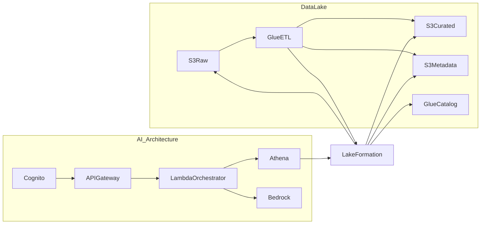

# Lake Formation Integration
## Beauty Products Data Lake

**Version:** 1.0.0  
**Last Updated:** 2026-01-17  
**Standards:** DAMA-DMBOK, AWS Well-Architected Framework  

---

## Purpose

This document explains how AWS Lake Formation is integrated into the existing data lake and AI architecture. The goal is to provide centralized governance, fine-grained access control, and auditability without disrupting current ETL and analytics workflows.

---

## Architecture Placement

Lake Formation sits as the governance layer between data storage (S3), metadata (Glue Catalog), and access services (Glue, Athena, AI orchestrator).

---

## Scope of Governance

Lake Formation governs:
- **S3 locations**: Raw, Curated, Metadata buckets
- **Glue Catalog**: Databases and tables
- **Access paths**: Glue ETL, Athena, and AI orchestration via Athena

It does not change:
- ETL logic in Glue
- S3 bucket lifecycle policies
- Data schemas or table definitions

---

## Permission Model

### Principals
- **Glue ETL role**: Full read/write to run ETL and manage tables
- **Athena role**: Read-only access for analytics and AI queries
- **Lake Formation service role**: S3 access on behalf of Lake Formation

### Databases
- `beauty_products_db`: Glue ETL create/alter/drop; Athena describe
- `beauty_products_metadata_db`: Glue ETL create/alter/drop; Athena describe

### Tables
- **Curated tables**: Athena SELECT, Glue ETL full access
- **Raw/Error/Quarantine tables**: Glue ETL full access
- **Metadata tables**: Athena SELECT, Glue ETL full access

---

## DAMA-DMBOK Alignment

Lake Formation strengthens governance by:
- **Data Governance**: Central policy enforcement and stewardship roles
- **Metadata Management**: Consistent access over Glue Data Catalog
- **Data Security**: Controlled access to zones and tables
- **Data Quality**: Protection of curated data integrity
- **Lineage and Audit**: Clear access trails for compliance reviews

---

## AWS Well-Architected Alignment

### Security
- Centralized access management and least privilege
- Fine-grained permissions at database/table level
- Audit-ready access patterns

### Reliability
- Governance layer independent of ETL logic
- Reduced risk of accidental exposure

### Operational Excellence
- Clear separation of responsibilities
- Simplified access troubleshooting via Lake Formation

### Cost Optimization
- Avoids duplication of IAM policies
- Reuse of existing Glue/Athena access patterns

---

## Operational Notes

1. **Parallel Governance**: IAM remains in place during initial rollout.
2. **Access Testing**: Validate Glue ETL and Athena queries after deployment.
3. **Audit Readiness**: Use CloudTrail with Lake Formation events for reviews.

---

## Related Files

- `terraform/lake-formation.tf`
- `terraform/iam.tf`
- `terraform/outputs.tf`
- `docs/s3-bucket-structure.md`
- `governance/data-governance-charter.md`
